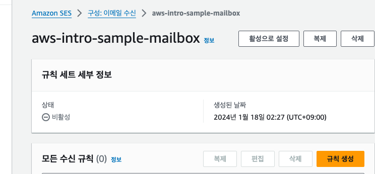

# 11장 메일 서버 준비하기

## 11.1 메일 시스템

- 메일 구성 요소
  - 송신자
  - 수신자
  - 제목
  - 본문
  - 첨부 파일

### 11.1.1 메일 전송 시스템


1. 앨리스가 속한 조직의 메일 서버에 밥을 수신자로 한 메일 송신 요청
2. 수신지인 밥의 메일 서버를 검색하고 메일 서버에 메일을 전송
3. 수신지 메일 서버의 메일함에 저장
4. 밥이 자신의 메일함을 확인

---

- 메일 프로토콜
  - 메일 송신 
    - SMTP
      - 송신한 메일이 수신자의 메일함에 도착하기까지의 과정을 담당
  - 메일 수신
    - POP3
    - IMAP4
    - POP3 와 IMAP4 는 수신자가 자신의 메일함에 있는 메일을 읽는 부분을 담당

---

### 11.1.2 POP3 와 IMAP4 비교


- POP
  - 메일함 안의 메일을 로컬 컴퓨터에 내려 받는다
  - 한번 내려받은 뒤에는 네트워크에 연결되지 않은 상태에서도 메일을 읽을 수 있지만, 다른 컴퓨터에서는 읽을 수 없다
  - 로컬 하드 디스크에 여유가 있는 한 계속 저장할 수 있다
- IMAP4
  - 브라우저 등을 이용해 직접 메일함의 메일을 읽는다
  - 인터넷에 연결되어 있기만 하면 어떤 컴퓨터에서나 메일을 읽을 수 있지만, 인터넷이 연결되지 않으면 메일을 읽을 ㅅ ㅜ없다
  - 메일함의 상한선 용량까지만 저장할 수 있다

## 11.2 Amazon SES

- Amazon SES 는 메일 송수신 기능을 제공하는 AWS 매니지드 서비스다
- 사람이 아니라 애플리케이션에서 메일을 송수신하는데 활용하기 좋은 기능이다

### 11.2.1 메일 송신

- 과거의 메일 서버에서는 조직에 소속된 많은 사용자를 메일 서버에 등록한다
- 사용자가 메일 서버에 SMTP 로 접속해 메일을 송신한다
- 접속할 때는 사용자가 ID 와 비밀번호를 입력한다
- 애플리케이션으로부터 메일을 송신할 때 메일 송신자는 사람이 아닌 특별한 계정이 된다
- Amazon SES 에서는 이런 특별한 계정을 3장에서 설명한 IAM 사용자로 등록하고, 해당 IAM 사용자를 이용해 메일을 송신한다
- IAM 사용자를 이용한 SES 연결 시의 인증 방법으로는 두 가지를 제공한다
  - Amazon SES API
    - API 를 경유해서 직접 Amazon SES 와 데이터를 주고 받는 방법
  - Amazon SES SMTP 인터페이스
    - 일반적인 메일 서버와 같은 SMTP 를 사용해 메일을 송수신 할 수 있다

### 11.2.2 메일 수신


- 일반적인 메일 서버는 도착한 메일을 각 사용자의 메일함에 저장한다
- 수신자는 POP3 나 IMAP4 와 같은 프로토콜을 이용해 메일을 수신해서 읽는다
- Amazon SES 는 POP3 또는 IMAP4 와 같은 프로토콜은 제공하지 않는다
  - 메일을 수신했을 때 액션 이라 불리는 처리를 실행한다
  - 액션을 이용해 애플리케이션에서 제공하는 커스텀 API 를 실행할 수 있으므로 사용자로부터 도착한 메일을 실시간으로 처리할 수 있다

#### 수신시 액션 목록

- S3 액션
  - 도착한 메일을 S3에 저장
- SNS 액션
  - 도착한 메일을 Amazon SNS 토픽에 공개
- Lambda 액션
  - Lambda 함수를 실행
- Bounce 액션
  - 송신자에게 바운스 응답을 반환
- Stop 액션
  - 도착한 메일을 무시

---

- SNS 액션을 등록해두면 사용자로부터 메일이 도착했을 때 관리자에게 메일이나 휴대전화의 푸시 알림을 보낼 수 있다 
- Lambda 액션을 등록해두면 애플리케이션의 커스텀 API 를 호출할 수 있다
- Amazon SES 에서는 메일을 수신했을 때 실시간으로 다양한 처리를 계속해서 실행할 수 있다

#### Amazon SES 에서의 메일 수신

- Amazon SES 는 POP3 또는 IMAP4 와 같은 일반적인 메일 서버에서 이용되는 수신용 프로토콜을 제공하지 않는다
- 관리자가 메일에 수동으로 대응할 수 없음을 의미한다
- 대신 제공되는 액션 기능을 고려하면 '고객 관리 시스템' 이라 불리는 시스템과 연동할 수 있다
- 사용자로부터의 메일을 이용한 문의에 어떻게 대응할지 검토한 뒤에 메일 수신 기능을 Amazon SES 로 구현하거나 다른 메일 서버로 구현할지 여부를 판단하는 것이 좋다

### 11.2.3 Amazon SES 를 생성하는 리전

- Amazon SES 에서는 생성하는 리전에 주의해야 한다
- 서울 리전에서는 2020년 7월 부터 Amazon SES 를 이용할 수 있게 되었으나, 송신 기능만 이용할 수 있다
- 만약 메일 수신도 Amazon SES 를 이용하고자 한다면, 수신에 대응하는 Amazon SES 를 구현할 수 있는 리전을 선택해야 한다
  - 미국 동부 (버지니아 북부) 리전 등이 수신에 대응한다

### 11.2.4 샌드박스

- 샌드박슨느 외부에 영향을 주지 않도록 격리된 환경을 말한다
- Amazon SES 를 생성한 초기시점에 해당 Amazon SES 는 악용을 방지하기 위해 샌드박스 내부에 위치한다
  - 메일 송신 대상자는 검증된 주소로만 한정된다
  - 메일 송신지는 검증된 주소 또는 등록한 도메인으로만 한정된다
  - 송수신할 수 있는 메일 건수가 200건/24시간 또는 1건/1초로 제한된다
- 위 조건을 해제하고 샌드박스 외부로 Amazon SES 를 이용하려면 AWS 지원센터로 요청해야 한다

## 11.3 메일 송수신 기능 생성하기

### 11.3.1 도메인 설정 내용

- 메일 서버로 관리할 도메인을 설정한다

### 11.3.2 도메인 설정 순서


- SES 에 도메인 등록 -> SES 대시보드 -> Configuration -> Verified identities -> Create Identity
- 도메인 이름 입력 
  - Identity type -> Domain 선택 -> 도메인 입력
  - Assign a default configuration set 과 Use a custom MAIL FROM domain 은 체크하지 않아도 된다 
- 도메인 확인
  - DKIM 설정 방법을 지정
  - DKIM 은 메일에 전자 서명을 넣어 위조된 메일이 아님을 보증하려는 것이며 무료로 이용할 수 있다
  - Easy DKIM 을 선택하고 나머지는 기본 값 그대로 둔다


> Amazon SES 에서 관리하는 도메인을 일반 DNS 서버에서 관리한다면, 여기에 쓰인 정보를 DNS 레코드를 이용해 수동으로 추가해서 대응할 수 있다

### 11.3.3 검증 완료 메일 주소 추가

- Amazon SES 는 샌드박스 안에 있기 때문에 검증 완료된 메일 주소를 이용해야만 메일을 송수신 할 수 있다.

#### 추가 순서


- SES 대시보드 -> Configuration -> Verified identities -> Create identity
- Identity type -> Email address 선택 -> 추가할 이메일 주소를 입력 -> Create identity

### 11.3.4 관리 콘솔에서 테스트 메일 송신

#### 테스트 메일 송신 순서


- 생성한 도메인의 체크박스에 체크 -> 테스트 이메일 전송
  - 이메일 형식
    - Formatted : 메일 내용만 지정
    - Raw : 내용과 시스템 지정
  - 발신 주소
    - 송신자 메일 주소를 지정
    - 도메인은 고정
    - 별도의 사용자  등록은 필요 없음
  - 시나리오
    - 테스트 상황에 따른 메일을 전송할 수 있다
    - Custom 을 선택하면 임의의 수신자에게 메일을 전송할 수 있다
  - 사용자 지정 수신자
    - 송신 대상지 메일 주소를 지정한다
    - Amazon SES 가 샌드박스 안에 있을 때는 검증 완료된 메일 주소를 이용해야 한다
      - 확인된 자격 증명 -> 자격증명된 이메일 주소
  - 제목
  - 본문

### 11.3.5 SMTP 를 이용한 메일 송신

- 애플리케이션에서 메일을 보내는 방법
  - SES API
  - SES SMTP 인터페이스
- 책에서는 일반적인 메일 서버와 같은 방법으로 구현할 수 있는 SES SMTP 인터페이스를 이용한다

#### 송신 순서


- SES 대시보드 -> SMTP 설정 -> SMTP 보안 인증 생성 
- 사용자 이름 (IAM 사용자) 지정 -> 사용자 생성
- 자격증명 csv 파일 다운로드
  - 이 화면이 넘어가면 두 번다시 다운받을 수 없다

---

#### SMTP 로 메일을 송신하는 파이썬 프로그램

```
# -*- coding: utf-8 -*-
from email import header
import smtplib
from email.mime.text import MIMEText
from email.header import Header
from email import charset

# smtp user name (csv 파일에 있음)
account = '***' 

# smtp password (csv 파일에 있음)
password = '***'

# smtp 서버 이름 (SMTP 설정 화면의 엔드포인트) 
server = '***'

# 송신자 메일 주소 
from_addr = '***'

# 수신자 메일 주소 
to_addr = '***' 

con = smtplib.SMTP_SSL(server, 465) # SMTP 는 보통 25 포트를 사용하지만 EC2 에서는 기본적으로 25번 포트에 대한 접근이 제한되므로 대신 465 를 지정한다
con.login(account, password)

cset = 'utf-8'
message = MIMEText(u'SMTP 테스트', 'plain', cset)
message['Subject'] = Header(u'SMTP 을 경유한 전자메일 송신 테스트', cset)
message['From'] = from_addr
message['To'] = to_addr

con.sendmail(from_addr, [to_addr], message.as_string())

con.close()
```


### 11.3.6 메일 수신

- 메일을 수신할 때의 액션을 지정할 수 있다
- 수신할 메일을 S3 에 저장한다
- 미리 SES 에서 쓰기 가능한 S3 버킷을 준비한다.

#### 메일 수신 규칙 셋 설정




- SES 대시보드 -> 이메일 수신 -> 규칙 세트 생성
- 규칙이름 지정 -> aws-intro-sample-mailbox

#### 수신 규칙 설정 - 규칙 설정


- 규칙 생성 
  - 수신 규칙 세부 정보
    - 규칙 이름 : 규칙 이름 입력
  - 보안 및 보호 옵션
    - 기본 값

#### 수신 규칙 설정 - 수신 가능 메일 주소 설정


- 수신용 메일 주소를 설정
- 메일 주소 도메인은 SES 에 등록된 도메인 이름과 같아야 한다
- 수신자 조건 -> 새 수신자 조건 추가 -> inquiry@도메인이름 

#### 수신 규칙 설정 - 메일 수신 시 액션 설정


- 새 작업 추가 -> S3 버킷으로 전송 -> 전송할 버킷 지정
- 규칙 생성

```
{
  "Version":"2012-10-17",
  "Statement":[
    {
      "Sid":"AllowSESPuts",
      "Effect":"Allow",
      "Principal":{
        "Service":"ses.amazonaws.com"
      },
      "Action":"s3:PutObject",
      "Resource":"arn:aws:s3:::aws-intro-sample-mailbox-study/*",
      "Condition":{
        "StringEquals":{
          "AWS:SourceAccount":"111122223333",
          "AWS:SourceArn": "arn:aws:ses:region:111122223333:receipt-rule-set/rule_set_name:receipt-rule/receipt_rule_name"
        }
      }
    }
  ]
}
```


### 11.3.7 샌드박스 외부로 이동

#### 이동 순서

- SES 대시보드 -> 설정시작 -> 프로덕션 엑세스 요청

