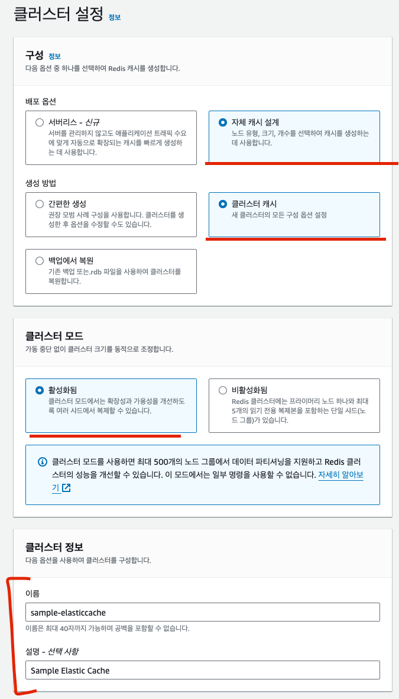

# 12장 캐시 서버란?

## 12.1 캐시 서버란?

### 12.1.1 캐시 시스템

#### 캐시 사용시 주의 점

- 시간이 걸리는 처리 결과 데이터가 캐시 데이터와 어긋날 가능성 
- 서버에 캐시 데이터 저장 영역이 필요

### 12.1.2 레디스와 멤캐시드

## 12.2 일래스틱 캐시

- 레디스와 멤캐시드는 모두 미들웨어로 제공 된다
- EC2 에서 생성한 리눅스 서버상에 설치해 서버로 작동시킬 수 있다
  - 운용이나 비용 측면에서 문제가 발생
- AWS 에서 레디스 및 멤캐시드와 호환되는 일래스틱 캐시 서비스를 제공한다

### 12.2.1 일래스틱 캐시 계층 시스템

- 일래스틱 캐시는 기본적으로 임의의 키에 대해 게시된 데이터를 반환하는 간단한 키/값 시스템을 제공한다
- 내부적으로는 다루는 데이터양이나 유형에 따라 성능을 높이는 구성을 제공한다

#### 노드 

- 일래스틱캐시의 최소 단위
- 캐시된 데이터가 실제로 저장되는 영역을 확보
- 노드별로 캐시 엔진, 시스템, 용량 등을 설정할 수 있다

#### 샤드

- 샤드는 1~6 개의 노드로 구성된다
- 노드는 하나의 프라이머리 노드와 여러 복제 노드로 구성된다
- 프라이머리 노드는 데이터의 갱신과 참조를 수행한다
- 복제노드는 프라이머리 노드에 수행한 업데이트 내용이 복제되어 동일한 상태가 유지된다
  - 데이터 참조는 프라이머리 노드와 마찬가지로 수행된다
  - 데이터 갱신 시에는 복제 노드에 복사되는 시간이 걸리지만 데이터 참조 시에는 노드 숫자 만큼 성능이 향상한다
  - 프라이머리 노드에 장애가 발생했을 때도 복제 노드를 계속 참조할 ㅅ ㅜ있으므로 내결합성이 향상된다
  - 일정한 조건을 만족했을 때 임의의 복제 노드를 프라이머리 노드로 승격시킬 수도 있다

#### 클러스터

- 여러 샤드로 구성된다
- 클러스터를 이용해 일래스틱캐시를 구성하면 샤드의 내용이 공유된다
- 멀티 AZ 기능을 이용하면 여러 가용 영역으로 분산될 수도 있다
- 한 가용 영역에서 장애가 발생했을 때는 짧은 시간 내에 다른 가용 영역으로 페일오버를 수행한다
  - 페일오버 : 이용 중인 환경이 이용 불가능한 상태가 되었을 때 미리 준비한 대체 환경으로 자동 전환되는 시스템을 말한다


- 샤드를 구성하면 단일 노드 장애가 발생했을 때의 내결합성 및 읽기 성능을 향상할 수 있다
- 클러스터를 구성하면 가용 영역에 장애가 발생했을 때 내결함성을 높일 ㅅ ㅜ있다
- 내결함성을 높일수록 노드 수와 함께 비용도 증가한다

## 12.3 일래스틱 캐시 생성하기


- 클러스터를 활성화하고 샤드 안의 노드가 3개(프라이머리 1 개 + 복제 2개) 이며 멀티 AZ 를 활성한 일래스틱 캐시를 생성한다

### 12.3.1 생성 내용

#### 일래스틱캐시 설정 항목


### 12.3.2 일래스틱캐시 생성 순서


- ElasticCache 대시보드 -> Redis -> 생성

#### ElasticCache 클러스터 만들기

- 클러스터 엔진과 모드를 설정한다




- 일래스틱캐시는 VPC 안에 생성되며 EC2 인스턴스 등에서 이용할 수 있다

## 12.4 작동 확인하기

#### SSH 를 이용해 EC2 연결

- VPC 내부의 EC2로부터 작동을 확인한다

#### nc 명령어 설치

- 일래스틱캐시 클러스터에 연결할 때는 nc (netcat) 명령어를 이용한다

```shell
ssh web01
sudo yum -y install nc
```

#### 클러스터 연결 테스트

- ElasticCache 대시보드에서 연결용 도메인과 포트 번호를 확인할 수 있다

```shell
nc sample-elasticcache.nhc5in.clustercfg.apn2.cache.amazonaws.com 6379
ping
quit
```

