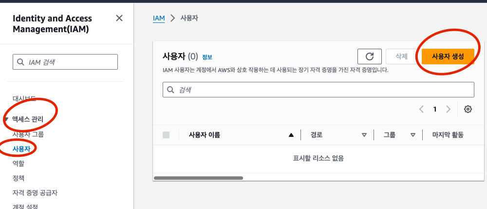

# 3장 안전한 조작 준비하기

## 3.1 IAM

> IAM (identity and Access Management) 은 AWS의 리소스 접근을 안전하게 관리하는 시스템이며, 인증과 접근 허가 기능을 구현한다

### 3.1.1 인증

> 인증이란 사용자가 누구인지에 관한 정보를 AWS 에 전달하는 과정

- 사용자에게 고유한 ID가 제공된다
- 사용자만 알 수 있는 정보 (비밀번호 등) 와 함꼐 로그인 정보로 입력한다.

### 3.1.2 접근 허가

> 접근 허가란 AWS 사용자가 어떤 기능을 사용할 수 있는가를 관리하고 허가하는 것

### 3.1.3 루트 사용자

> 루트 사용자는 AWS 의 모든 리소스에 접근할 수 있는 매우 강력한 접근 권한을 가진 계정이다

- 루트 사용자는 AWS 계약 해지나 사용자 관리 등 특수한 작업 이외에는 이용하지 않는다.
- 통상적으로 일반 사용자를(IAM 사용자) 만들고 권한을 부여한다

### 3.1.4 사용자와 그룹

- 사용자별로 접근 허가를 설정할 수도 있다
- 사용자가 늘어나면 개별 접근 허가를 설정하기란 어렵다
  - 설정 누락이 발생 하기도 한다
- 그룹을 이용한 접근 허가 관리 방법도 제공한다
  - 접근 허가를 사용자가 아닌 그룹에 부여한다
- 사용자 수가 적더라도 그룹을 이용해서 관리할 것을 권장한다

---

## 3.2 IAM 대시보드를 이용해 안전성 확인하기

> IAM 에서는 AWS 를 안전하게 이용하기 위한 기능을 제공한다

- 인증이나 접근 허가를 수행하는 설정이 올바르지 않으면 부정 이용이 발생하거나, 높은 비용이 청구될 수도 있다

> 모멈 사례
> 1. AWS 계정 루트 사용자의 엑세시크 잠금
> 2. MFA 활성화
> 3. 개별 IAM 사용자 생성
> 4. 사용자 그룹을 이용한 접근 권한 할당
> 5. 사용자에 대한 강력한 암호 정책 구성

### 3.2.1 AWS 계정 루트 사용자의 액세스키 잠금

- AWS 에서는 사용자가 조작하는 2가지 방법이 있다 
  1. 대시보드 등을 이용해 조작하는 방법
     - ID와 비밀번호를 이용 
  2. 프로그램을 통해 리소스를 조작하는 시스템
     - 액세스키 정보 이용
- 루트 사용자의 액세스 키는 없는 상태로 둬야 한다
  - 강력한 접근 권한을 가지므로, 프로그램으로 리소스 조작을 권장하지 않기 때문

---

> 액세스키 삭제 방법

#### 1. 보안 자격 증명 화면 열기

#### 2. 액세스 키 삭제

---

### 3.2.2 MFA 활성화

- 메일 주소와 비밀번호의 조합만으로 로그인 하는 것은 안전한 인증 방법은 아니다
- 더 안전한 방법을 위해 MFA 를 이요한다
  - MFA : 2개 이상의 요소를 조합, 멀티 팩터 인증
- AWS 에서는 비밀번호 + 인증 디바이스 두 가지로 MFA 를 수행한다
- 현재는 스마트폰을 가상 MFA 디바이스로 이용하는 방법이 많이 쓰인다
  - 특정 스마트폰으로만 생성할 수 있는 유효 기간이 짧은 인증 번호를 생성할 수 있다

---

> 가상 MFA 디바이스를 이용하는 방법

#### 1. 인증용 스마트폰에 MFA 용 애플리 케이션 설치

#### 2. 보안 자격 증명 관리 화면 열기

#### 3. MFA 활성화

#### 4. 디바이스 종류 선택

#### 5. 가상 MFA 디바이스 설정

---

### 3.2.3 개별 IAM 사용자 생성

> 일반 사용자인 IAM 사용자 생성

#### 1. IAM 대시보드에서 '사용자 추가' 실행

- 엑세스 관리 -> 사용자 -> 사용자 추가

#### 2. 사용자 세부 정보 설정

- 생성할 IAM 사용자 정보 입력
- 사용자 이름은 다른 사용자와 중복 불가
- 액세스 유형 선택

#### 3. 권한 설정

- IAM 사용자에 대한 접근 권한을 부여한다
- 사용자를 그룹에 추가할 수 있다
- 그룹을 동시에 생성할 수도 있다

#### 4. 태그 추가

#### 5. 검토 및 생성

---

> IAM 사용자도 MFA 를 활성화 하는 것이 좋다

### 3.2.4 사용자 그룹을 이용한 접근 권한 할당

#### 1. 대시보드에서 그룹 생성

- IAM 대시보드 -> 액세스 관리 -> 사용자 그룹 -> 그룹 생성

#### 2. 그룹 이름 설정

#### 3. 권한 정책 연결

- AWS 는 매우 다양한 리소스를 제공하기 때문에 개별적으로 접근 권한을 부여하는 것은 현실적이지 않다
- 여러 리소스로의 접근 권한을 묶은 정책을 제공한다
- 정책을 그룹에 연결할 수 있다
- 정책은 직접 만들 수도 있고, 미리 설정되어 제공되는 정책을 사용할 수도 있다
  - PowerUserAccess : AWS 모든 리소스에 대한 접근 권한
  - IAMFullAccess : IAM 에 대한 모든 접근 권한

#### 4. 그룹에 사용자 추가

#### 5. 그룹 생성 완료

---

### 3.2.5 사용자에 대한 강력한 암호 정책 구성

> 비밀번호 정책을 설정한다

#### 1. 암호정책 변경 관리 화면 열기

- IAM 대시보드 -> 액세스 관리 -> 계정설정

#### 2. 암호 정책 변경

