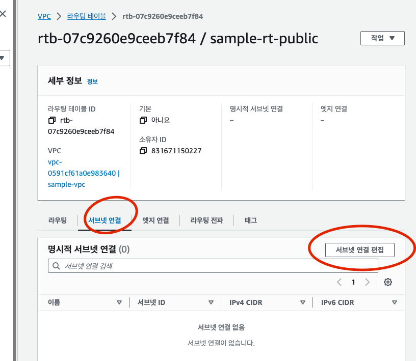

# 4장 가상 네트워크 만들기

## 4.1 네트워크

> 네트워크란 인프라스트럭처 관리자가 주체가 되어 관리하는 장소

## 4.2 VPC

### 4.2.1 VPC 란 ?

- AWS 를 이용해 네트워크 구축시 VPC (amazon virtual private cloud) 시스템을 이용할 수 있다
- 기기 추가나 삭제를 간단히 수행할 수 있다
- VPC 끼리는 독립적이므로 서로 영향일 미치지 않는다

---

### 4.2.2 생성 내용

> VPC 를 생성할 때는 사전에 네트워크 정보를 결정해야 한다

| 항목            | 값               | 설명                            |
|---------------|-----------------|-------------------------------|
| 이름 태그         | sample-vpc      | VPC 식별 이름                     |
| IPv4 CIDR 블록  | 10.0.0.0/16     | VPC 에서 이용하는 프라이빗 네트워크 IPv4 범위 |
| IPv6 CIDR 블록  | IPv6 CIDR 블록 없음 | VPC 에서 이용하는 프라이빗 네트워크 IPv6 범위 |
| 테넌시 (tenancy) | 기본 값            | VPC 리소스의 전용 하드웨어에서의 실행 여부     |

#### 이름 태그

VPC 를 쉽게 식별하고자 알기 쉬운 이름을 붙인다

#### IPv4 CIDR 블록

- VPC 에서 사용하는 프라이빗 네트워크용 IP 주소의 범위를 지정
- 가능한 주소 범위
  - 24 비트 : 10.0.0.0 ~ 10.255.255.255
  - 20 비트 : 172.16.0.0 ~ 172.31.255.255
  - 16 비트 : 192.168.0.0 ~ 192.168.255.255
- VPC 에서 지정할 수 있는 서브넷 마스크는 최대 16비트까지 이므로 어떤 범위를 이용해도 달라지는 점은 없다
  - 관리 편의에 따라 주소 범위를 선택하면 된다

#### IPv6 CIDR 블록

VPC 에서 IPv6 의 이용 여부를 지정한다, 특별한 이유가 없는한 '없음' 을 선택한다

#### 테넌시

- VPC 상의 리소스를 전용 하드웨어에서 실행할지 지정
- 기본 으로 설정하면 다른 AWS 계정과 하드웨어 리소스를 공유하도록 선택하는 것과 같다
- 신뢰성이 매우 중요한 시스템의 경우에는 '전용' 으로 설정하는 것을 검토해도 좋다
- '전용' 으로 설정하면 별도 비용이 추가된다

---

### 4.2.3 VPC 실행 순서

> VPC 생성

#### 1. VPC 대시보드 -> 가상 프라이빗 클라우드 -> VPC -> VPC 생성


#### 2. VPC 설정


---

## 4.3 서브넷과 가용 영역

### 4.3.1 서브넷과 가용 영역이란?

> VPC 안에는 하나 이상의 서브넷을 반들어야 한다.

- 서브넷은 VPC 의 IP 주소 범위를 나타내는 단위다
- IP 주소 범위를 나누는 대표적인 이유는 두 가지 이다
  1. 역할 분리
  2. 기기 분리

#### 역할 분리

- 리소스가 담당하는 역할에 따라 분리한다
  - ex) 외부 공개 및 비공개
- 리소스가 포함된 그룹 전체에 대해 할당하면 설정 누락등을 피할 수 있다

#### 기기 분리

- 내결합성을 높이기 위해 기기를 분리한다
- 내결합성이란 하드웨어 고장 등 예측할 수 없는 사태가 발생했을 때 시스템 자체를 사용하지 못하게 되는 것을 방지하는 능력이다
- VPC 에는 가용영역이 존재한다
- 가용영역이 다르면 독립되었음을 보장할 수 있다
  - 가용 영역별로 서브넷을 제공하면 여러 서브넷을 동시에 이용하지 못하는 가능성을 낮출 수 있다

```text
장애에 강한 서비스를 만들려면 가능한 여러 가용 영역에 걸쳐 인프라스트럭처를 구축하는 것이 좋다
```


### 4.3.2 IPv4 CIDR 설계 방법

> 서브넷을 한 번 만들면 해당 서브넷이 이용하는 CIDR 블록은 변경할 수 없다

- CIDR 설계시 고려 사항
  1. 생성할 서브넷의 수
  2. 서브넷 안에 생성할 리소스 수
- 생성하는 서브넷 수가 늘어나면 서브넷 안의 리소스 수는 줄어든다

| 서브넷 CIDR 목록 (주황:VPC, 하늘: 서브넷, 강조: 리소스)                                                                       | 서비스수 | 리소스 수 |
|--------------------------------------------------------------------------------------------------------------|------|-------|
| <span style="color:orange">00001010.00000000</span>.<span style="color:skyblue">XXXXXXXX</span>.**XXXXXXXX** | 256  | 251   |
| <span style="color:orange">00001010.00000000</span>.<span style="color:skyblue">XXXX</span>**XXXX.XXXXXXXX** | 16   | 4091  |
| <span style="color:orange">00001010.00000000</span>.<span style="color:skyblue">XX</span>**XXXXXX.XXXXXXXX** | 4    | 16379 |

> 리소스 수는 이론적인 최대값에서 AWS 가 예약한 5개를 뺀 값이다.

- 일반적으로는 서브넷 수와 리소스 수 각각에 여유를 두고 설정하는 것이 좋다

> 책 에서의 서브넷 CIDR 설계

| 서브넷       | CIDR 블록                                            |
|-----------|----------------------------------------------------|
| public01  | 00001010.00000000.0000XXXX.XXXXXXXX (10.0.0.0/20)  |
| public02  | 00001010.00000000.0001XXXX.XXXXXXXX (10.0.16.0/20) |
| private01 | 00001010.00000000.0100XXXX.XXXXXXXX (10.0.64.0/20) |
| private02 | 00001010.00000000.0101XXXX.XXXXXXXX (10.0.80.0/20) |

---

### 4.3.3 생성 내용

- 생성할 서브넷은 두 가지 사항을 조합해 총 4개의 서브넷을 생성한다
  - 외부에 공개 (public) / 비공개 (private)
  - 이중화


> 서브넷 4개 생성 정보


- VPC ID 에는 서브넷을 생성할 VPC ID 를 선택한다
- 서브넷 이름은 서브넷에 붙이는 이름이다
- 가용 영역에는 서브넷을 생성할 가용 영역을 선택한다 
  - 리전 별로 선택할 수 있는 가용 영역이 다르다
- IPv4 CIDR 블록에는 서브넷에 지정할 수 있는 IP 주소 범위를 지정한다
  - 이 범위는 반드시 VPC 생성 시 지정한 범위에 포함되어야 한다

---

### 4.3.4 서브넷 생성 순서

> 서브넷 생성

#### 1. VPC 대시보드 -> 서브넷 -> 서브넷 생성


#### 2. 서브넷 생성 정보 입력

- IPv4 CIDR 의 Block 은 따로 지정이 불가능 했다 -> 왜일까?
- 그 아래 있는 IPv4 subnet CIDR block 에 대신 지정을 했다 -> 둘이 무슨 차이일까?


---

## 4.4 인터넷 게이트웨이

### 4.4.1 인터넷 게이트웨이란 ?

> 인터넷 게이트웨이란, VPC 에서 생성된 네트워크와 인터넷 사이의 통신을 가능하게 하는 것

- 인터넷 게이트웨이가 없으면 인터넷과 VPC 안의 리소스는 서로 통신할 수 없다.


### 4.4.2 생성 내용

> 생성할 인터넷 게이트웨이 확인


| 항목    | 값          | 설명                 |
|-------|------------|--------------------|
| 이름 태그 | sample-igw | 인터넷 게이트웨이 이름       |
| VPC   | sample-vpc | 인터넷 게이트웨이와 연결할 VPC |

---

### 4.4.3 인터넷 게이트웨이 생성 순서

> 인터넷 게이트웨이를 생성해본다

#### 1. VPC 대시보드 -> 인터넷 게이트웨이 -> 인터넷 게이트웨이 생성


#### 2. 인터넷 게이트웨이 설정 -> 이름태그 입력 -> 인터넷 게이트웨이 생성


#### 3. 인터넷 게이트웨이 선택 -> 작업 -> VPC 에 연결

- 생성한 인터넷 게이트웨이를 VPC 에 연결한다


#### 4. VPC 선택 -> 인터넷 게이트웨이 연결


---

## 4.5 NAT 게이트웨이

### 4.5.1 NAT 게이트웨이란?

- 인터넷 게이트웨이의 역할은 VPC에서 생성된 네트워크와 인터넷 사이의 통신을 수행하는 것
- VPC 에서 생성된 네트워크 안에 만들어진 리소스는 외부 네트워크와 직접 통신하므로 공개 IP 를 가져야 한다
  - 공개 IP를 가진다는 것은 인터넷에 직접 공개 된다는 의미이므로, 서브넷을 퍼블릭과 프라이빗으로 구분한 의미가 사라진다
- 프라이빗 서브넷에 생성된 리소스는 인터넷으로 내보낼 수는 있지만, 인터넷에서 접근할 수는 없어야 한다
- 요구사항을 구현하기 위해 NAT (network address translation) 라는 네트워크 주소 변환 시스템이 있다
- AWS 에는 NAT 을 구현하는 NAT 게이트웨이를 제공한다.
- NAT 게이트웨이는 퍼블릭 서브넷에 대해 생성한다
- 이중성을 확보하려면 여러 NAT 게이트웨이를 생성하는 것이 좋다
- 게이트웨이마다 각각 비용이 들기 때문에 하나의 NAT 게이트웨이만 제공해 운용하기도 한다


> 탄력적 IP
> - AWS 에서는 리소스에 공개 IP 를 직접 할당할 수없다
> - AWS 에서는 공개 IP 를 관리하는 탄력적 IP 기능을 제공한다
>   - AWS 로부터 공개 IP 가 할당된다
> - 탄력적 IP 를 리소스에 할당해서 리소스가 간접적으로 공개 IP 를 갖도록 할 수 있다

---

### 4.5.2 NAT 시스템

- 내부에서 외부로 통신을 수행할 때, private ip 만 포함한 정보를 public ip 도 포함한 정보로 변환하는 시스템을 NAT 이라 부른다

---

### 4.5.3 생성 내용

> 생성할 NAT 게이트웨이를 확인
> - 퍼블릭 서브넷이 2개
> - 각각 NAT 게이트 웨이를 생성


- 서브넷에서는 NAT 게이트웨이를 생성할 퍼블릿 서브넷을 지정한다
- 탄력적 IP 할당 ID 에는 NAT 게이트웨이에 할당할 탄력적 IP 를 지정한다
- 사전에 생성한 사용하지 않는 탄력적 IP 를 지정하거나 자동 생성할 수도 있다.

---

### 4.5.4 NAT 게이트웨이 생성 순서

> NAT 게이트 웨이 생성

#### 1. VPC 대시보드 -> NAT 게이트웨이 -> NAT 게이트웨이 생성


#### 2. NAT 게이트웨이 설정 -> NAT 게이트웨이 생성


- '이름' 에는 NAT 게이트웨이 이름을 입력한다
- '서브넷' 에는 NAT 게이트웨이를 생성할 퍼블릭 서브넷을 선택한다
- '탄력적 IP 할당 ID' 에는 탄력적 IP 주소를 지정한다

> 생성한 NAT 게이트웨이는 약간의 시간이 지난 뒤 활성화 된다. <br><br>
> 

- 나머지 NAT 게이트웨이도 생성


---

## 4.6 라우팅 테이블

### 4.6.1 라우팅 테이블이란?

- VPC 에 서브넷을 생성하고 리소스를 생성할 장소를 준비했고, 인터넷 게이트웨이와 NAT 게이트웨이를 생성해 리소스가 인터넷과 통신할 수 있도록 입구를 만들었다.
- 하지만 서브넷과 서브넷 또는 서브넷과 각 게이트웨이가 통신할 수 있는 경로가 아직 존재하지 않는다
- 어떤 서브넷 안의 리소스가 서브넷 밖의 리소스에는 접근할 수 없다.
- 서브넷 사이의 통신 경로를 설정하고자 AWS 에서는 라우팅 테이블 기능을 제공한다
- 라우팅 테이블에는 이 서버에 접속할 때는 이 곳을 경유한다는 규칙을 설정할 수 있다.


> ex) 속한 서브넷 public subnet 1, public subnet 2

| 송신 대상지      | 타깃               | 용도            |
|-------------|------------------|---------------|
| 10.0.0.0/16 | Local            | VPC 안의 다른 리소스 |
| 0.0.0.0/0   | Internet Gateway | 기타 모든 통신 대상   |

- 송신 대상지
  - 접속 대상 위치에 관한 정보
  - 송신 대상지는 IP 주소를 지정한다
  - 특정한 값을 지정하거나 CIDR 형식을 이용해 범위로 지정할 수도 있다
- 타깃 
  - 경유지에 관한 정보
  - 주로 사용되는 타깃이 있다
    - 로컬 : 동일 VPC 안의 리소스 접근
    - 인터넷 게이트웨이 : 퍼블릭 서브넷에 생성된 리소스가 인터넷 서버와 통신
    - NAT 게이트웨이 : 프라이빗 서브넷에 생성된 리소스가 인터넷 서버와 통신
    - VPN 게이트웨이 : VPN 을 통해 접속된 독자 네트워크상의 서버와 통신
    - VPC 피어링 : 접속을 허가한 다른 VPC 상의 리소스와 통신
- 이 책의 샘플에서는 퍼블릭과 프라이빗 두 가지 서브넷을 제공한다
  - 각각 2개의 가용 영역에서 생성했으므로, 총 4개의 서브넷이 존재한다
- 모든 서브넷에 라우팅 테이블을 작성해야 한다
- 여러 서브넷이 같은 라우팅 테이블을 공유할 수도 있다.
- 라우팅 테이블 생성 설꼐
  - 퍼블릭 라우팅 테이블 : 퍼블릭 서브넷 1, 2 공유
  - 프라이빗 라우팅 테이블 1 : 프라이빗 서브넷 1 전용
  - 프라이빗 라우팅 테이블 2 : 프라이빗 서브넷 2 전용

---

### 4.6.2 생성 내용

> 생성할 라우팅 테이블 확인


#### 라우팅 테이블 사용 방법


| 통신 내용     | 설명                                                                                                     |
|-----------|--------------------------------------------------------------------------------------------------------|
| A -> A` 통신 | 리소스 A 는 public subet 1 에 있으므로 퍼블릭 서브넷 공용 라우팅 테이블을 이용한다<br/>리소스 A` 는 VPC 안에 있으므로 Local 타깃으로서 접근한다       |
| B -> X 통신 | 리소스 B 는 private subnet 1 에 있으므로 프라이빗 서브넷 1용 라우팅 테이블을 이용한다<br/>리소스 X 는 VPC 밖에 있으므로 NAT 게이트웨이 1 경유로 접근한다 |
| C -> X 통신 | 리소스 C 는 private subnet 2 에 있으므로 프라이빗 서브넷 2용 라우팅 테이블을 이용한다<br/>리소스 X는 VPC 밖에 있으므로 NAT 게이트웨이 2 경유로 접근한다  |

---

### 4.6.3 라우팅 테이블 생성 순서

> 라우팅 테이블을 생성해본다

#### 1. VPC 대시보드 -> 라우팅테이블 -> 라우팅테이블 생성


#### 2. 항목 입력 및 선택 -> 라우팅 테이블 생성

- 이름 : 라우팅 테이블 식별 이름 
- VPC : 라우팅 테이블을 설정할 서브넷을 포함하는 VPC


#### 3. VPC 대시보드 -> 라우팅 테이블 -> 라우팅 테이블 체크 -> 라우팅 탭 선택 -> 라우팅 편집


#### 4. 라우팅편집 -> 라우팅 추가 -> 송신 대상자 및 대상 선택 -> 변경사항 저장

- 송신 대상자와 타깃을 지정할 수 있다


#### 5. 서브넷 연결 편집 -> 라우팅 테이블이 속하는 서브넷 지정 -> 연결저장




#### 나머지 라우팅 테이블도 생성


---

## 4.7 보안 그룹

### 4.7.1 보안 그룹 이란?


- VPC 상 다양한 리소스 생성 준미를 마쳤다.
  - 하지만 이 상태에서는 인터넷을 통해 모든 리소스에 접근할 수 있다
- VPC 안의 리소스를 보호하려면 외부로부터의 접근에 제한을 걸어야 한다
- 이런 접근 제한을 수행하기 위해 보안그룹 이라는 기능을 제공한다
- 보안 그룹에는 두 가지 개념을 이용해 제어할 수 있다
  - 포트 번호 
    - 제공하는 서비스의 종류를 지정 
    - 80 (HTTP)
    - 443 (HTTPS)
    - 22 (SSH)
  - IP 주소
    - 접속원을 지정 
    - IP 주소들을 지정
      - 조직 외부로부터의 접근을 막을 수 있다

---

### 4.7.2

> 보안그룹 생성 내역 확인

- 2개의 보안 그룹이 필요하다
  - 모든 리소스에 접속하는 입구인 '점프서버' (5장에서 설명)
  - 요청이나 처리를 분산하는 '로드 밸런서' (7장에서 설명)


---

### 4.7.3 보안 그룹 생성 순서

> 보안 그룹 생성

#### 1. VPC 대시보드 -> 보안그룹 -> 보안 그룹 생성


#### 2. 기본 세부 정보 -> 기본적인 정보 설정


#### 3. 인바운드 규칙 -> 규칙 추가


#### 4. 아웃바운드 규칙 -> 규칙 추가 -> 태그 -> 보안 그룹 생성


#### 로드 밸런서용 보안 그룹도 생성


---

> 네트워크 ACL 과 보안그룹

- 보안그룹 : 리소스에 대한 설정 가능
- 네트워크 ACL : 네트워크에 대한설정, 즉 해당 서브넷에 포함되는 리소스에 모두 적용
- 네트워크 ACL 과 보안 그룹의 2단계로 접근 제한 설정을 수행하면, 보안 그룹 설정 누락을 네트워크 ACL 로 막을 수 있다
- 엑세스 제한을 두 군데서 관리함에 따라 운용 비용이 증가하는 단점도 발생한다
- 설정 누락은 IaC 시스템등을 이용해 방지할 수 있으므로, 네트워크 ACL 을 이용하지 않아도 된다.