# 5장 점프 서버 준비하기

## 5.1 점프서버란?

- 리소스스의 접속은 제한된 관리자만 수행할 수 있어야 한다
  - 이런 설정들을 모든 리소스에 수행하기란 어렵고, 누락이 있을 수 있다
- 그래서, 모든 리소스에 접속할 수 있는 입구인 점프 서버를 준비한다. (거의 숭례문)
- 점프 서버를 준비하고, 해당 서버를 경유해야 리소스에 접속할 수 있는 방식을 많이 사용한다
- 점프서버는 EC2 를 이용해 구축할 수 있다
- 점프서버 자체는 리소스 통로 이외의 용도는 없다
- 성능이 낮아도 된다
- 일반적으로 SSH 를 이용해 접속한다 (대부분 리눅스 기반이기 때문에)
- SSH 를 경유하려면 비밀키와 공개키의 키페어가 있어야 한다.

---

## 5.2 SSH 접속에 필요한 키 페어 준비하기

### 5.2.1 생성 내용


| 항목    | 값     | 설명                |
|-------|-------|-------------------|
| 이름    | 개인 이름 | SSH 접속에 이용하는 키 이름 |
| 파일 형식 | pem   | SSH 접속 방식         |

- 키 페어는 기본적으로 작업하는 사람에게 속한다
  - 키 페어의 이름은 작업자의 고유한 이름을 이용하는 것이 좋다
- 파일형식은 pem 을 사용한다
  - 윈도우 10 이전에는 ppk 
  - 윈도우 10 및 맻 에서는 pem

### 5.2.2 키페어 생성 순서

#### 1. EC2 대시보드 -> 네트워크 및 보안 -> 키페어 -> 키페어 생성

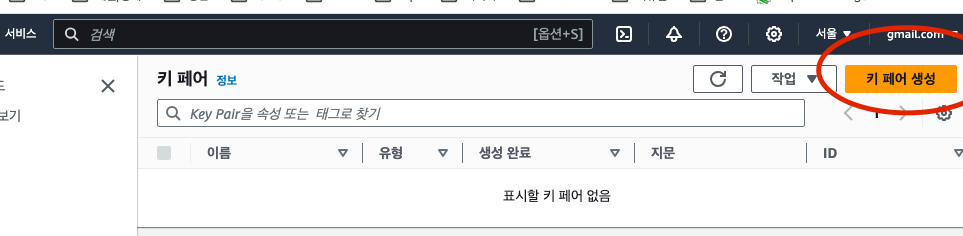

#### 2. 키페어 이름, 파일형식 선택 -> 키페어 생성

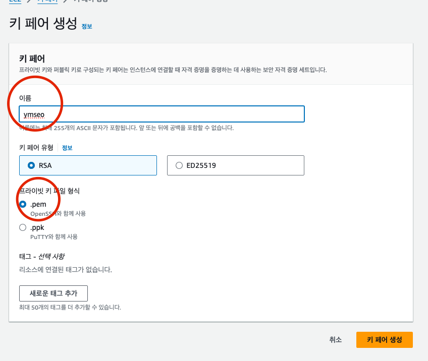

---

## 5.3 점프 서버 준비하기

### 5.3.1 생성 내용

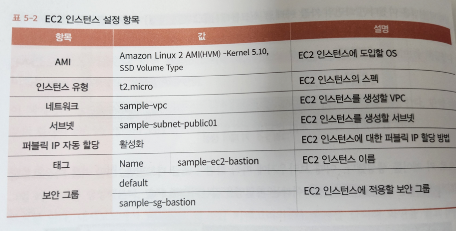

### 5.3.2 EC2 인스턴스 생성 순서

#### 1. EC2 대시보드 -> 인스턴스 -> 인스턴스 시작

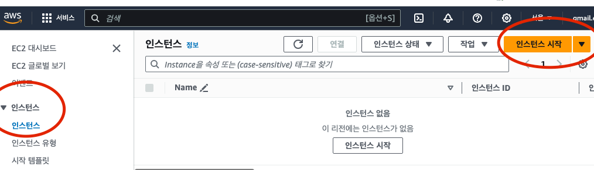

#### 2. 인스턴스 설정 및 시작

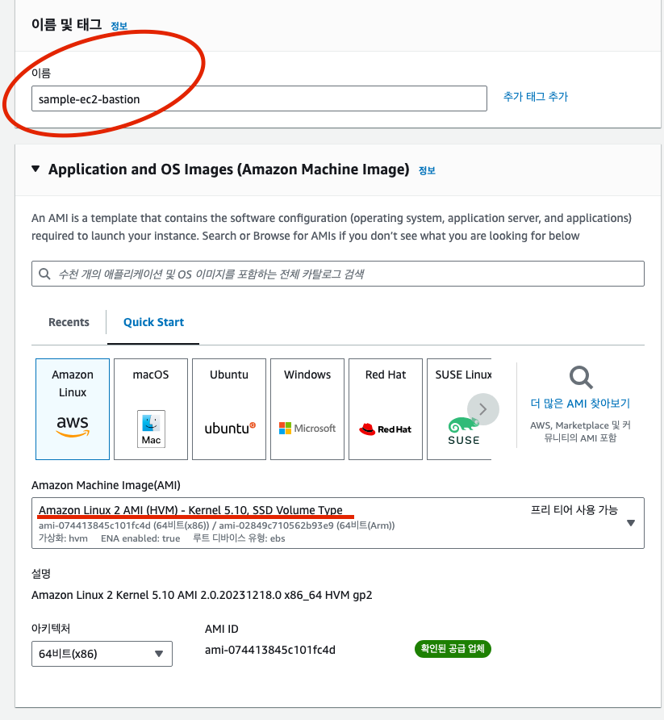

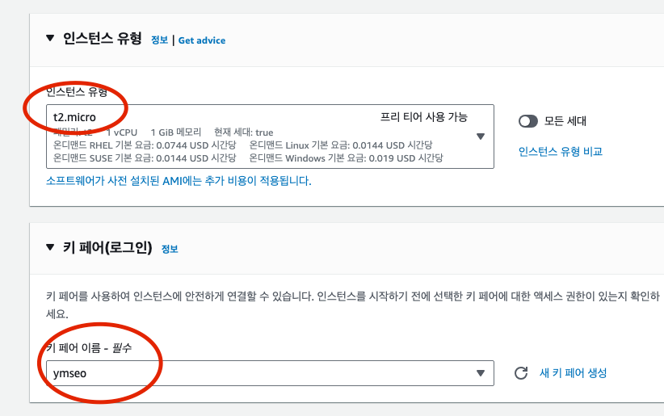

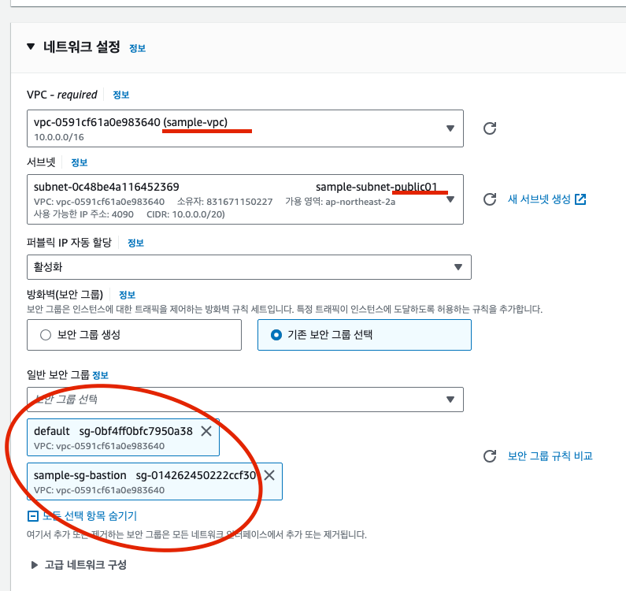

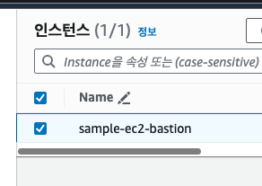

---

## 5.4 접속 확인하기

### 5.4.1 접속 확인 순서

#### 1. EC2 인스턴스 -> 연결 -> 사용자 이름 및 퍼블릭 IP 정보 확인

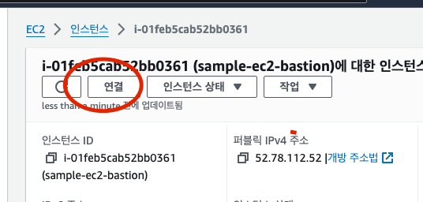

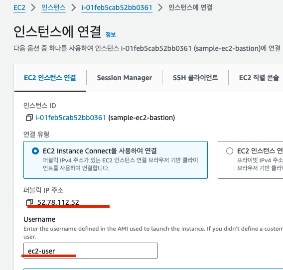

#### 2. 권한 변경 

```shell
chmod 600 ymseo.pem
```

#### 3. 연결

```shell
ssh -i {pem키} {유저}@{퍼블릭IP}
```

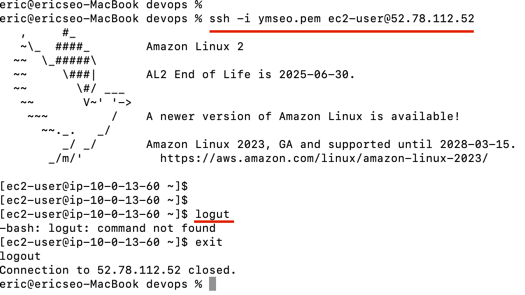

---


