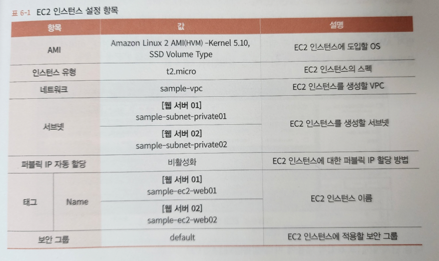
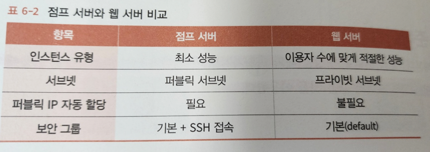
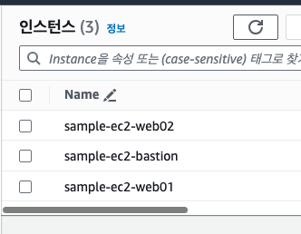

# 6장 웹 서버 준비하기

## 6.1 웹 서버란 ?

## 6.2 웹 서버 준비하기

- 점프 서버를 생성할 때와 마찬가지로 키 페어와 EC2 인스턴스를 이용해 구축한다
- 키 페어는 점프 서버와 같은 것을 이용한다

### 6.2.1 생성 내용



### 6.2.2 점프 서버와 비교

- 점프서버
  - 시스템 관리자가 가끔 이용
  - 인터넷에서 직접 연결
- 웹서버
  - 웹 서비스 사용자가 항상 연결 시도
  - 로드 밸런서에서 간접 연결



### 6.2.3 EC2 인스턴스 생성 (웹서버)



---

## 6.3 접속 확인하기

- 웹서버는 프라이빗에 생성했기때문에, 점프 서버를 경유해서 연결한다
- 점프서버 SSH 연결 -> 웹서버 SSH 연결
  - 두 가지 문제점
    - ssh 명령어 2번 입력
    - 비밀키 파일을 점프 서버에 전송해야 한다
- 비밀 키 파일 운영과 관련한 것은 보안적 측면에서도 피해야 한다
- 해결책 
  - 다단계 연결

### 6.3.1 접속 확인 순서

#### 다단계 연결 준비

- 다단계 연결 설정은 config 라는 이름의 파일을 생성하고 그 안에 기술한다
- 홈 디렉토리의 .ssh 폴더에 지정

```shell
Host bastion
    Hostname {점프 서버의 퍼블릭 IP}  {1-2}
    User ec2-user
    IdentityFile {pem key}
     
Host web01
    Hostname {웹 서버 프라이빗 IP}   {2-2}
    User ec2-user 
    IdentityFile {pem key}
    ProxyCommand {경유 서버 / ssh bastion -W %h:%p}

Host web02
    Hostname {웹 서버 프라이빗 IP}
    User ec2-user 
    IdentityFile {pem key}
    ProxyCommand {경유 서버 / ssh bastion -W %h:%p} 
    
---
    
Host bastion
    Hostname 52.78.112.52
    User ec2-user
    IdentityFile /Users/eric/Desktop/devops/ymseo.pem
     
Host web01
    Hostname 10.0.72.126
    User ec2-user 
    IdentityFile /Users/eric/Desktop/devops/ymseo.pem
    ProxyCommand ssh bastion -W %h:%p

Host web02
    Hostname 10.0.91.210
    User ec2-user 
    IdentityFile /Users/eric/Desktop/devops/ymseo.pem
    ProxyCommand ssh bastion -W %h:%p 
```

- Host 
  - 연결할 서버
- Hostname
  - 연결할 서버의 IP
  - {1-2} 의 점프서버의 Hostname 은 퍼블릭 IP (외부에서 요청이 들어오기 때문)
  - {2-2} 의 웹 서버의 Hostname 은 프라이빗 IP (점프 서버로부터 요청이 들어오기 때문, 내부에서 요청이 들어옴)
- User
  - 연결할 때의 사용자 이름
- IdentityFile 
  - 비밀키 파일의 경로
  - ssh 명령어를 실제로 입력한느 컴퓨터상의 파일 경로
  - bastion, web01, web02 다 똑같다
- ProxyCommand
  - 경유하는 점프 서버의 경로
  - 점프서버에서는 불필요
  - `ssh.exe {점프서버 별명} -W %h:%p`

#### ssh 명령어를 이용해 연결

```shell
ssh {서버 별명}
```