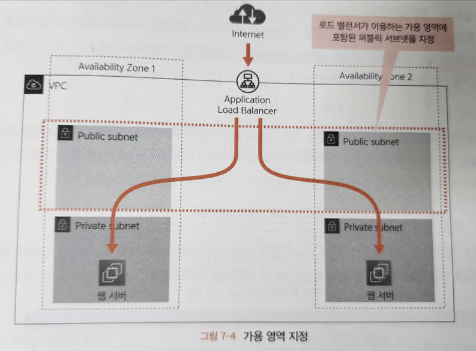

# 7장 로드 밸런서 준비하기

## 7.1 로드 밸런서란?

### 7.1.1 로드 밸런서의 역할

- 로드 밸런서의 역할 
  - 요청 분산
  - SSL 처리
  - 부정 요청 대응

#### 요청 분산

- 인터넷으로부터 전송된 요청을 여러 웹 서버에 균등하게 분산

#### SSL 처리

- 송수신하는 데이터를 암호화 하는 SSL 처리
- 데이터 암호와/복호화 처리는 복잡한 계산을 수행하므로 웹 서버에서 수행하면 부하가 걸린다
  - 그러므로 로드 밸런서에서 수행한다
  - 로드 밸런서에서는 암호 관련 처리를 빠르게 수행하는 전용 시스템이 제공 된다
  - 웹 서버에서 처리하는 것보다 더 빠른 처리 속도를 가진다

#### 부정 요청 대응

- 올바른 요청이 아닌, 예상치 못한 행동을 유발하는 부정한 요청에 대한 대응
  - 웹 서버에서 하면 높은 부하가 걸려 웹서버 자체가 다운될 가능성도 있다
  - 부정한 접근을 허용하게 되면 웹 서버가 탈취될 수도 있다
- 로드 밸런서에서는 부정한 접근에 대응하는 전용 시스템이 제공 된다

---

### 7.1.2 AWS 에서 제공하는 로드 밸런서

- ELB 종류
  - ALB : 어플리케이션
  - NLB : 네트워크
  - CLb : 크래식

#### ALB

- HTTP/HTTPS 접근 분산에 최적화
- SSL 처리 수행
- URL 패턴 등 복잡한 조건으로 분산 대상 선정 가능

#### NLB

- 기본적인 분산처리 기능만을 제공
- 다양한 통신 프로토콜에 대응하는 로드 밸런서
- 양방향 통신 구현시 쓰이는 소켓 통신 등을 분산시킬 때 이용

#### CLB

- 과거의 LB
- 현재는 사용하지 않는다

---

### 7.1.3 로드 밸런서를 이용한 라우팅 

- 웹 애플리케이션을 인터넷에 공개할 때 보통 HTTP/HTTPS 로 공개한다.
  - 보통 LB 에서 설정 수행
- 하지만, 내부의웹 서버는 반드시 이 설정에 맞출 필요는 없다
  - LB 는 HTTP/HTTPS 로 받지만, 내부 웹서버는 HTTP 로만 받아도 된다 
  - LB 는 80/443 포트로 받지만, 내부 웹서버는 3000, 8080 등의 포트로 받아도 된다
  - 이를 요청 라우팅이라 부른다
- HTTPS 를 HTTP 로 변환하는 이유는 HTTPS 의 암호 및 복호화 처리를 웹서버에서 수행하지 않도록 하기 위함이다
- 포트 번호를 변경하는 이유는 웹 서버의 보안을 높이기 위해서이다
  - 리눅스 등의 OS 에서는 0~1023 까지의 포트로 데이터를 받으려면 강력한 권한을 가진 사용자(root)로 프로그램을 작동해야 한다
  - 프로그램을 악의를 가진 사용자에게 빼앗기면 강력한 권한 역시 악의를 가진 사용자에게 전달된다
  - 따라서, 로드밸런서 내부의 웹서버에서는 보통 1024 이상의 포트번호를 이용해 일반 권한을 가진 사용자로 작동한다

---

## 7.2 로드 밸런서 생성하기

### 7.2.1 생성 내용

### 7.2.2 가용 영역

- 가용 영역은 LB 가 이용하는 가용 영역을 지정한다
- 인터넷 게이트웨이로의 경로가 있는 서브넷을 지정해야 한다
- 서브넷을 잘못 지정하면 외부로부터 웹 서버에 도달할 수 없다

### 7.2.3 로드 밸런서와 대상 그룹

- ALB 설정 항목
  - 로드 밸런서
  - 대상 그룹

#### 로드 밸런서

- 어떤 프로토콜 (HTTP, HTTPS 등) 을 이용할 것인지
- 인터켓에서 로드 밸런서로 접근할 때와 같은 설정
- 클라이언트로부터 처리를 받는 기능은 리스너 라고 부른다

#### 대상 그룹

- 어떤 웹 서버에 요청을 분산할 것인가
- 로드 밸런서로부터 웹 서버로 접근할 때와 관련한 설정을 수행
- 로드 밸런서 하나에는 여러 대상 그룹을 지정할 수 있다

---

## 7.2.4 로드 밸런서 생성 순서

#### 1. EC2 대시보드 -> 로드밸런서 -> 로드 밸런서 생성 -> 로드 밸런서 유형 선택

#### 2. 로드 밸런서 기본 설정

- Basic Configuration
  - 이름 설정

#### 3. VPC 와 가용 영역 설정

- Network mapping 
  - VPC 와 가용 영역을 설정
  - 가용 영역에서 생성한 두 개의 퍼블릭 서브넷을 각각 지정

#### 4. 보안 그룹 설정

- Security groups
  - 보안 그룹 설정

#### 5. 리스너 및 라우팅 설정

- Listeners and routing
  - 기본적으로 HTTP 80 에 대한 리스너가 제공 된다
- 대상 그룹 선정
  - 리스너의 기본 작업 밑에 대상 그룹 생성을 선택하면 화면이 나온다
  - 타켓 유형 선택 (인스턴스)
  - 대상 그룹 이름 지정
  - 프로토콜 과 포트 는 로드 밸런서에서 웹 서버에 연겨할 때 이용하는 포트 번호를 입력한다
  - VPC 는 대상 그룹에 포함시킬 VPC fmf tjsxorgksek
  - 프로토콜 버전은 통신할 프로토콜에 맞는 버전을 선택한다
  - 헬스체크에는 웹 서버의 작동 상황을 확인할 경로를 지정한다
- 대상 등록
  - 타킷을 등록한다
  - 대상 그룹에 등록할 EC2 인스턴스 선택
  - 아래에 보류 중인 것으로 포함 버튼 클릭 
  - 대상 그룹 생성 버튼 클릭
- 리스너 및 라우팅 설정
  - 대상 등록이 끝난 후 설정
  - 생성한 대상그룹 리스너에 지정
- 로드 밸런서 생성

---

## 7.3 작동 확인하기

### 7.3.1 HTTP 요청을 받을 준비

#### 파이썬으로 HTTP 서버 기동

- 올바르게 기동 되면 로드밸런서로부터 헬스 체크 에 대한 엑세스 로그가 표시된다
- 요청 라우팅 확인
  - 대상 그룹 -> 대상 탭
  - 상태가 healthy 로 바뀌면 웹 서버로 요청이 라우팅 된다

---

### 7.3.3 브라우저에서 접근

- EC2 대시보드 -> 로드밸런서 -> 세부정보 탭
  - 로드 밸런서의 설정정보를 확인할 수 있다 (DNS 등)
- LB DNS로 브라우저에서 접근
  - web01 -> Hello world
  - web02 -> Hellow world!!!!

