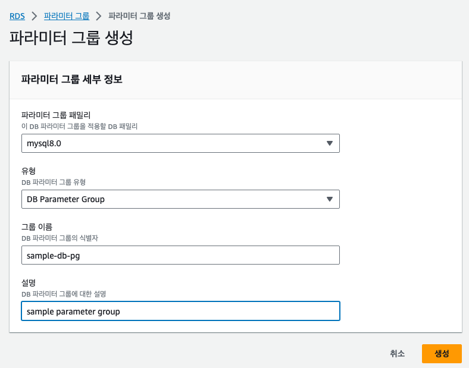
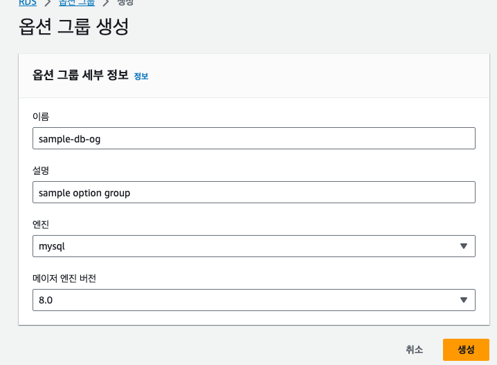
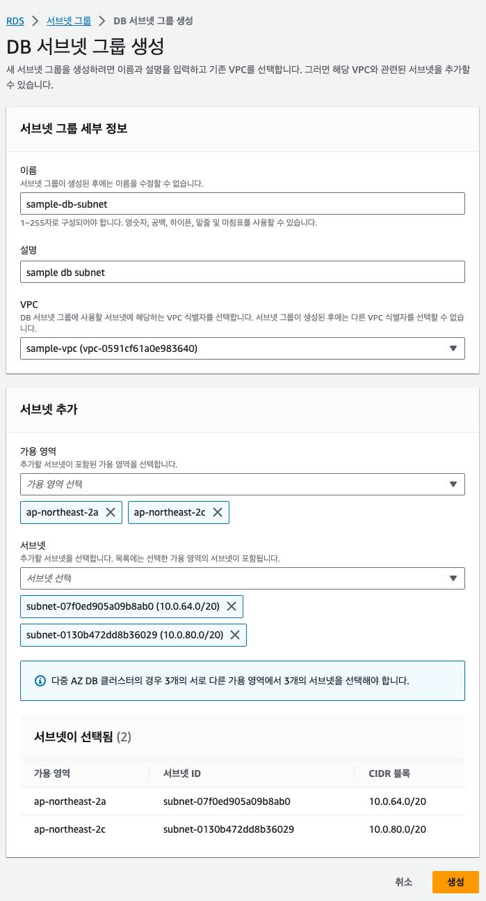
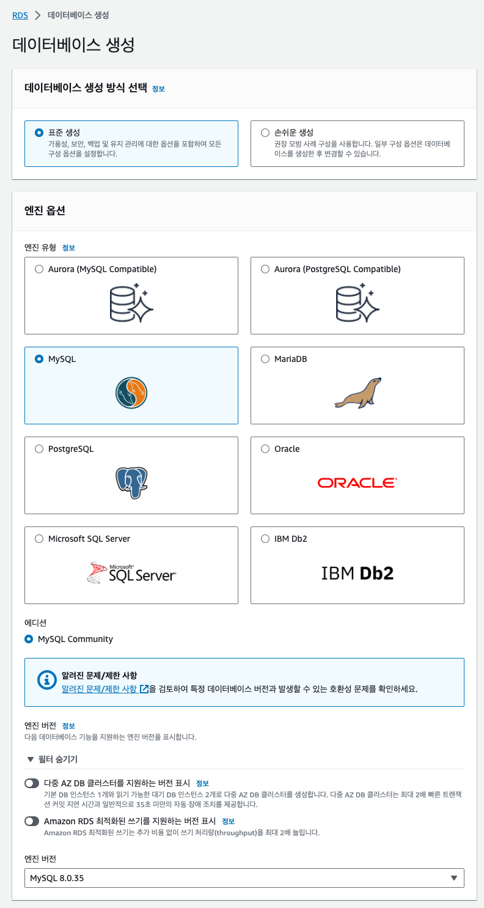
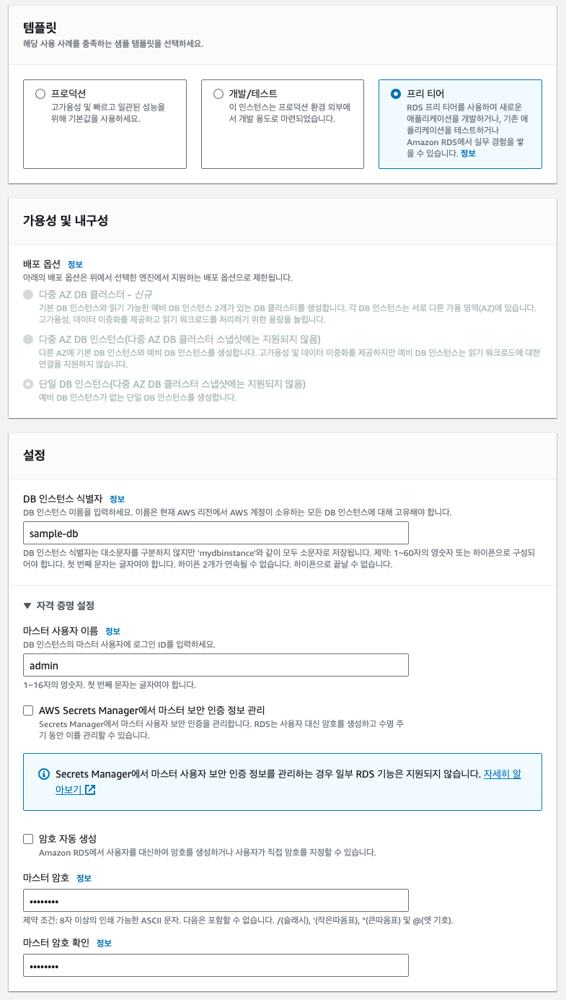
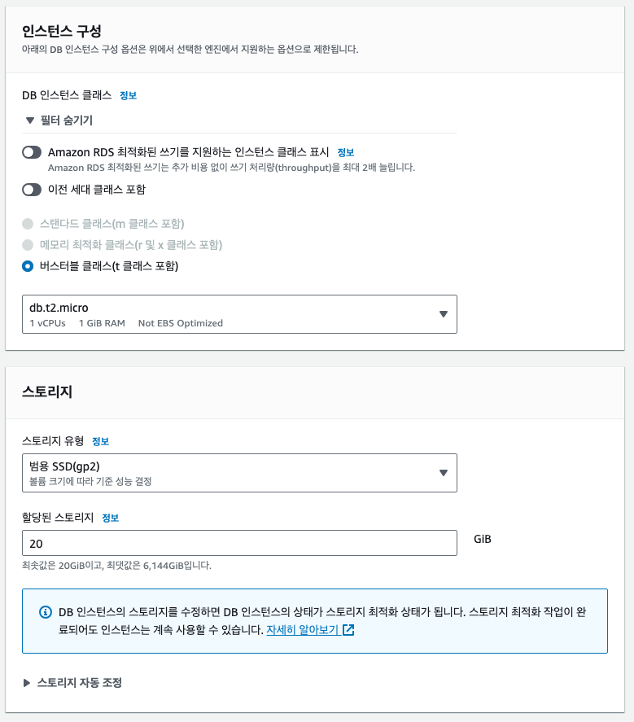
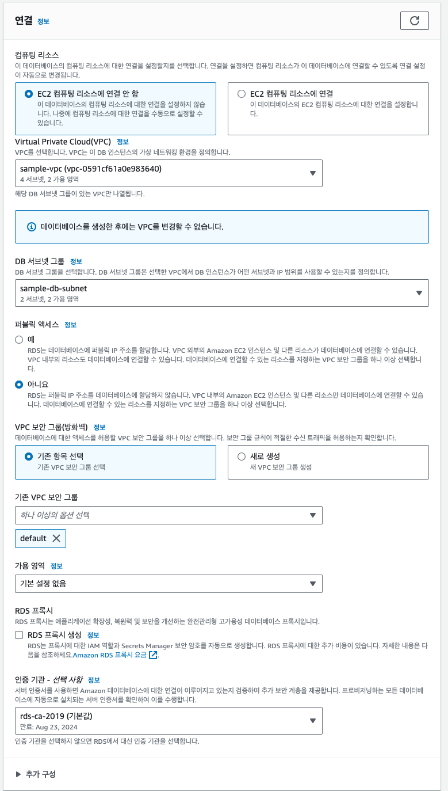
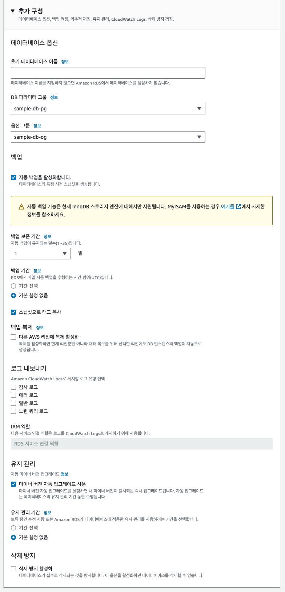
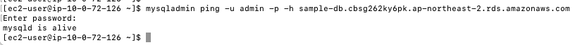

# 8장 데이터베이스 서버 준비하기

## 8.1 데이터베이스 서버란?

## 8.2 RDS

> EC2 로 생성한 서버에 이 제품을 설치해서 데이터베이스 서버로 제공할 수도 있다

- EC2에 데이터베이스 설치시 문제점 발생
  - 제품을 설치해야 한다
  - EC2 의 OS 를 직접 관리해야 한다
  - 예측하지 못한 장애 발생에 대응할 준비를 해야 한다

> AWS 의 RDS 매니지드 서비스를 사용하면 위 문제가 해결 된다

---

### 8.2.1 RDS 시스템

> RDS 구성 요소
> 1. 데이터베이스 엔진
> 2. 파라미터 그룹
> 3. 옵션 그룹
> 4. 서브넷 그룹

#### 데이터베이스 엔진

- 데이터가 저장되거나 질의에 응답하는 데이터베이스 본체
- 데이터베이스 엔진은 성능을 높이거나 내결합성을 높이기 위해 내부적으로 여러 인스턴스로 구성된다

#### 파라미터 그룹

- 데이터베이스 엔진 고유의 설정을 수행한다
- 사용하는 언어나 데이터베이스 튜닝을 설정할 수 있다

#### 옵션 그룹

- RDS 고유의 설정을 수행
- AWS 를 이용한 데이터베이스 모니터링에 관한 설정 등을 수행할 수 있다

#### 서브넷 그룹

- 데이터베이스 서버를 여러 개의 가용 영역에 분산 배치할 때 이용되는 설정
- 여러 데이터베이스 서버를 분산시켜 제공할 수 있는 서브넷들을 거브넷 그룹으로 설정한다

---

## 8.3 데이터베이스 서버 생성 흐름

> RDS 생성 순서
> 1. 파라미터 그룹 생성
> 2. 옵션 그룹 생성
> 3. 서브넷 그룹 생성
> 4. 데이터베이스 생성

----

## 8.4 파라미터 그룹 생성하기

- 파라미터 그룹은 데이터베이스의 설정을 수행한다
- 데이터베이스의 성능 개선, 사용 현황 파악, 기능 추가등을 수행할 수 있다
- 사전 제공되는 기본 파라미터가 있지만 변경할 수 없다
- 반드시 새로운 파라미터 그룹을 생성해서 데이터베이스에 적용한다

### 8.4.1. 생성 내용

- 파라미터 그룹 패밀리 : mysql8.0
- 그룹 이름 : sample-db-pg
- 설명 : sample parameter group

### 8.4.2 파라미터 그룹 생성 순서

#### 1. RDS 대시보드 -> 파라미터 그룹 -> 파라미터 그룹 생성



- 파라미터 그룹 패밀리 : 적용할 데이터베이스를 선택
- 유형 : DB Parameter Group 과 DB Parameter Cluster Group 중 선택
  - 여기에서는 클러스터를 이용하지 않으므로 DB Parameter Group 선택
- 그룹 이름 : 고유한 이름
- 설명 : 그룹 설명

---

### 8.5 옵션 그룹 생성하기

### 8.5.1 생성 내용

### 8.5.2 옵션 그룹 생성 순서

#### 1. RDS 대시보드 -> 옵션 그룹 -> 그룹 생성



- 이름 : 고유한 이름
- 설명 : 그룹 설명
- 엔진과 메이저 엔진 버전 : 옵션 그룹을 적용할 데이터베이스 종류 지정

---

## 8.6 서브넷 그룹 생성하기

- EC2 를 생헝할 때는 서브넷을 직접 지정했다
- RDS 를 작성할 때는 서브넷 그룹을 지정하고 어떤 서브넷에 생성되는지는 AWS 에 일임한다
- RDS 는 멀티AZ 기능을 제공한다
  - 자동으로 여러 가용 영역에 데이터베이스를 작성하고 내결합성을 높일 수 있다

### 8.6.1 생성 내용

### 8.6.2 서브넷 그룹 생성 순서



#### 1. RDS 대시보드 -> 서브넷 그룹 -> 서브넷 그룹 생성 

- 이름 : 고유한 이름
- 설명 : 그룹 설명
- VPC : 서브넷 그룹에 포함된 서브넷이 속한 VPC 를 설정한다

#### 2. 서브넷 추가

- 4장에서 생성한 프라이빗 서브넷 2개와 이를 포함한 가용영역을 추가한다
- 가용영역 : 프라이빗 서브넷이 포함된 가용영역 2개
- 서브넷 : 프라이빗 서브넷 2개
- 2개의 프라이빗 서브넷이 '선택한 서브넷' 에 추가된다
- **(주의)** 퍼블릭 서브넷을 서브넷 그룹에 추가하면 외부에 데이터베이스가 공개 되므로 보안에 문제가 발생한다  

---

## 8.7 데이터베이스 생성하기

### 8.7.1 생성 내용

### 8.7.2 데이터베이스 생성 순서











#### 1. RDS 대시보드 -> 데이터베이스 -> 데이터베이스 생성

1. 데이터베이스 생성 방법 선택
   - 모든 항목을 수동으로 설정하는 `표준생성` 선택
   - 선택에 따라 이후 카테고리에서 선택할 수 있는 항목이 달라진다
2. 엔진 옵션
   - 데이터베이스 엔진을 선택한다
   - 책에서는 mysql 을 선택한다
   - 버전은 최신 버전이 기본으로 설정된다
3. 템플릿
   - 설정에 대한 기본값을 결정하거나, 선택할 수 있는 항목을 어느 정도 필터링할 수 있다
   - 학습용이기에 프리티어를 선택한다
4. 설정
   - DB 인스턴스 식별자 : 고유한 이름
   - 마스터 사용자 이름 : 관리하는 사용자의 이름
   - 마스터 암호 : 마스터가 데이터베이스에 접속할 때 이용할 비밀번호
5. DB 인스턴스 클래스
   - DB 인스턴스 클래스를 선택
6. 스토리지
   - 스토리지 유형 
     - 데이터베이스 서버가 사용할 스테이지 유형 선택
   - 스토리지 할당
     - 데이터베이스 서버가 이용할 수 있는 스토리지의 크기 지정
     - 앞서 선택한 템플릿별로 적절한 값이 기본적으로 설정된다
   - 스토리지 자동 조정
     - 기본값을 그대로 이용하는 것이 좋다
     - 최대 스토리지 임곗값은 인프라스트럭처의 비용을 고려한 뒤 상한값으로 설정하는 게 좋다
7. 가용성 및 내구성
   - AWS 가용성과 내구성을 높이려면 여러 가용 영역을 동시에 이용하도록 리소스를 설정해야 한다
   - 멀티AZ 를 설정하면 하나의 데이터베이스를 여러 가용 영역에 배치해 준다
   - 멀티 AZ 를 선택하면 실제 가동할 데이터베이스와 만약의 경우를 위해 대기하는 데이터베이스 2개를 이용하게 되므로 비용 역시 거의 두배가 된다
   - 프리티어를 선택한 경우 멀티AZ 배치를 선택할 수 없다
8. 연결
   - Virtual Private Cloud(VPC) 
     - 생성한 VPC 를 지정한다
     - 앞에서 생성한 서브넷 그룹을 필두로 올바른 값이 기본으로 설정된다
   - 기존 VPC 보안그룹 
     - default 를 선택해 VPC 안에서의 접근을 허가하도록 한다
9. 데이터베이스 인증
   - 암호인증
     - 생성한 마스터 사용자로 데이터베이스에 연결할 수 있다
   - 암호 및 IAM 데이터베이스 인증
     - 마스터 사용자 이외에 적절하게 권한을 부여한 IAM 사용자로 데이터베이스에 연결할 수 있다
     - 장점 : IAM 이 제공하는 안전한 사용자 관리를 이용할 수 있다
     - 단점 : 데이터베이스에 연결하는 사용자를 데이터베이스 외부에서 관리해야 하므로 관리가 복잡하다
10. 추가 구성
    - DB 파라미터 그룹 설정
    - 옵션 그룹 설정

---

## 8.8 작동 확인하기

> MySQL 명령어는 Amazon Linux 2에 기본적으로 포함되지 않으므로 별도 설치해야 한다

```shell
$ ssh web01
$ sudo yum -y install mysql
```

- 연결 정보는 RDS 대시보드에서 확인할 수 있다
- 생성된 인스턴스의 연결&보안 탭에서 확인 가능하다

```shell
$ mysqladmin ping -u admin -p -h {host}
$ mysqladmin ping -u admin -p -h sample-db.cbsg262ky6pk.ap-northeast-2.rds.amazonaws.com

> mysqld is alive
```

