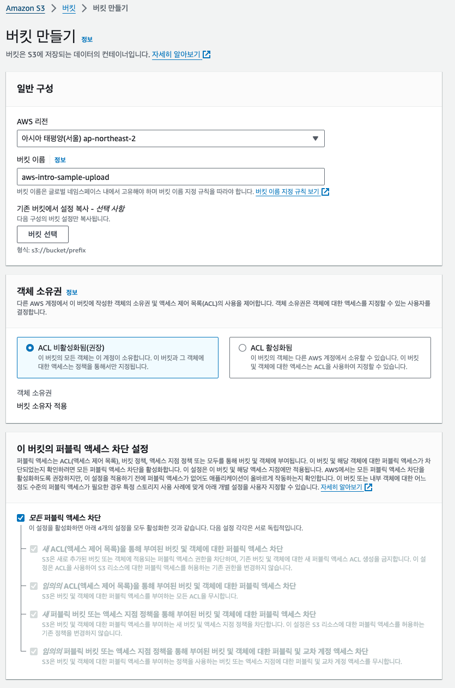
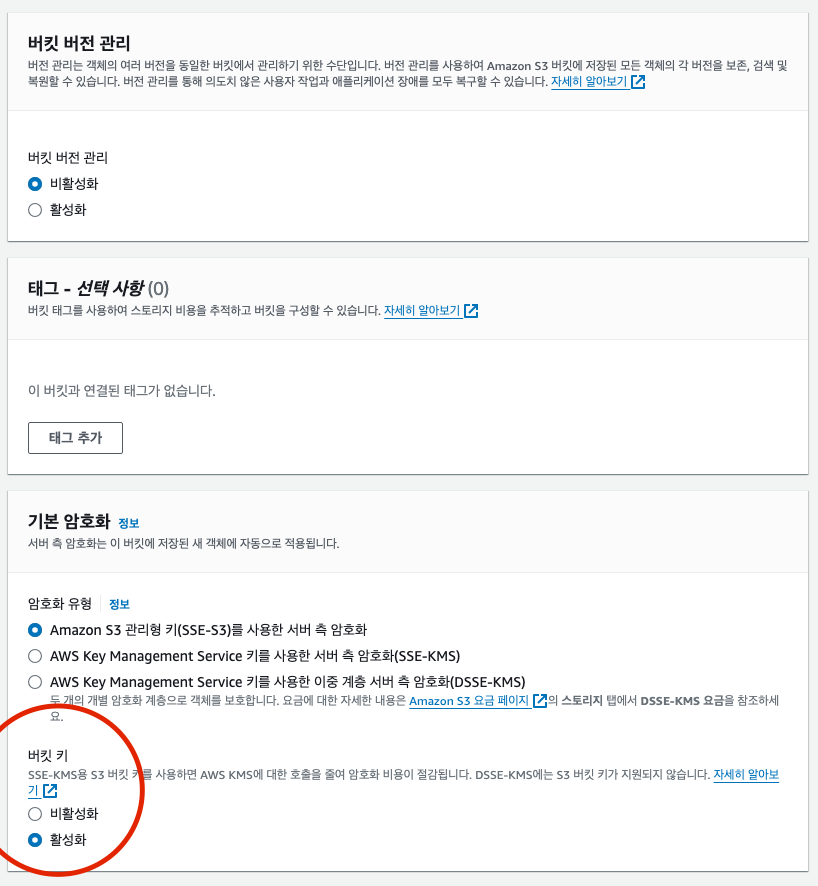
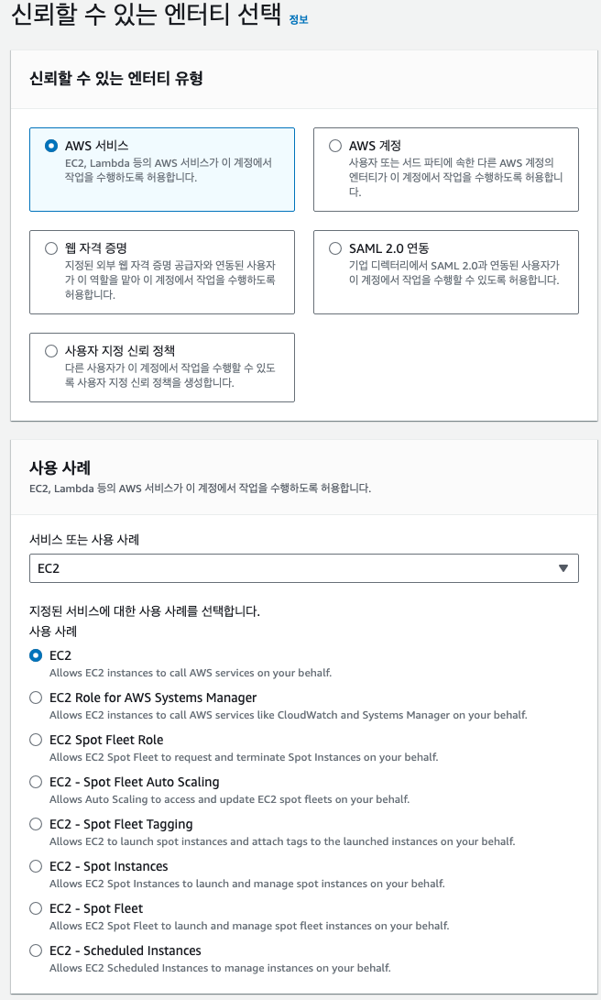
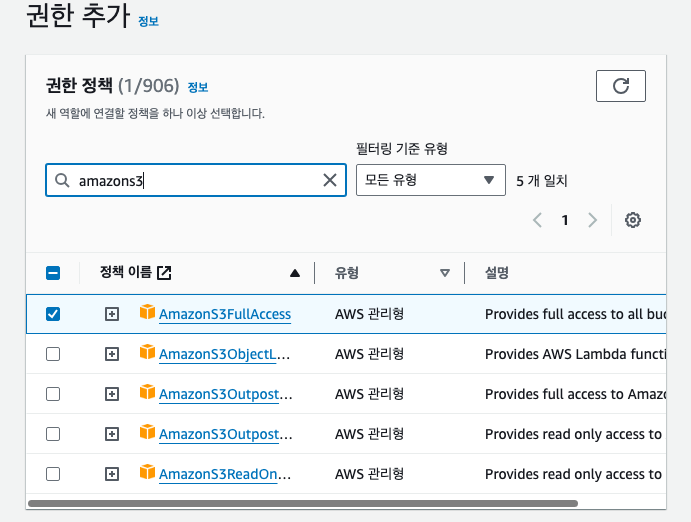
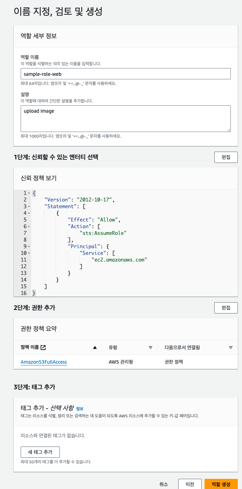
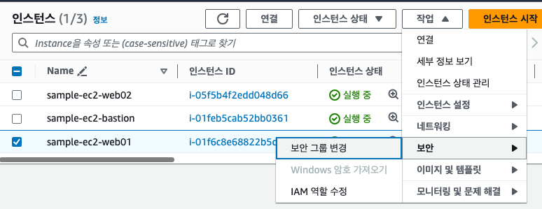
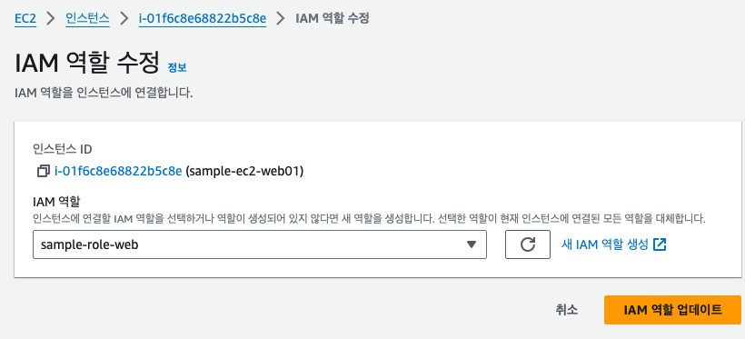
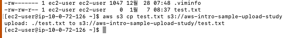
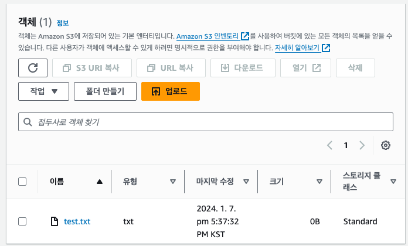

# 9장 이미지 저장 장소 준비하기

## 9.1 스토리지

> 스토리지는 데이터를 오랫동안 저장하는 것을 목적으로 제공되는 데이터 저장 장소이다

## 9.2 S3

- EC2 인스턴스는 SSD 나 하드 디스크에 해당하는 스토리지를 제공한다 (EBS)
  - EBS 사용시 문제점
    - EC2 인스턴스의 OS 자체도 관리해야 한다
    - 예측하지 못한 장애 발생 시 대응이 필요한 경우 준비를 해야한다
    - EC2 인스턴스를 사용하지 못할 가능성이 있다 (1년에 약 5분 정도 서비스가 정지될 가능성이 있다)
- 위와 같은 문제를 해결하기 위해 AWS 에서 S3 서비스를 제공한다

### 9.2.1 S3 의 작업 범위와 비용

- S3 는 내결합성과 비용 측면에서 EBS 보다 압도적으로 우수하다
  - EBS의 경우 AWS 에서 보증하는 수치가 없다
    - 반면, S3 는 내구성 99.999999999% 를 달성하도록 설계 되어있다
    - 계산상으로는 1천만 개의 파일을 1만년 동안 손상 없이 저장할 수 있을 정도의 수치다
    - 실무에서는 저장된 파일이 손상되어 사라질 일은 거의 없다고 생각해도 좋다
  - 비용은 용량에 따라 계산된다
    - EBS 의 비용이 S3 보다 5배 더 비싸다
    - EBS 는 EC2 의 비용도 추가 된다
- 성능이나 비용측면에서 S3 가 우위에 있지만 외부 스토리지 서비스라는 한계가 있다
  - EBS와 달리 C 드라이브나 D 드라이브 등으로 활용할 수 없다
  - 리눅스나 맥에서의 파일시스템처럼 마운트 할 수도 없다

### 9.2.2 S3 와 VPC 의 관계

- S3 는 VPC 밖에 생성한다
- S3 에 접근하는 방법으로는 다음과 같은 두 가지를 고려할 수 있다
  1. 인터넷으로부터 직접 접근
  2. VPC 로부터 접근
- VPC 안의 리소스로부터 접근할 때는 S3 버킷에 대한 접근 권한이 필요하다
  - IAM 역할 이라는 개념을 이용해서 적용한다
  - 대상이 되는 S3 버킷에 접근하기 위한 정책을 가진 역할을 생성한다
  - 그 역할을 EC2 에 적용한다

### 9.2.3 S3 시스템

- S3 에 데이터를 저장할 때는 버킷을 생성해야 한다
  - 버킷은 S3 에서 관리하는 데이터를 하나로 모은 단위이다
- 버킷 안에는 서비스에서 이용하는 데이터인 객체를 저장한다
- 객체는 파일에 해당하며 텍스트, 이미지, 음성, 동영상 등 파일로 다룰 수 있는 것은 대부분 S3 객체로 취급할 수 있다
- 대량의 객체가 존재할 때는 폴더를 이용해 시스템적으로 관리할 수 있다

---

## 9.3 S3 버킷 생성하기

### 9.3.1 생성 내용

- 버킷 이름은 같은 리전의 모든 버킷에서 중복되지 않아야 한다

### 9.3.2 버킷 조작 순서





#### S3 대시보드 -> 버킷 -> 버킷 만들기

1. 일반구성
  - 버킷 이름과 리전을 설정한다
2. 이 버킷의 퍼블릭 엑세스 차단 설정
   - 데이터로의 접근 권한 설정
   - 이 설정은 데이터의 의도치 않은 열람 또는 변경을 방지하기 위해 매우 중요하다
   - 기본값으로 '모든 퍼블릭 엑세스 차단'에 체크되어 있으며 데이터는 공개되지 않는다
   - 의도치 않은 열람이나 변경 방지
   - 용도에 맞춰 필요한 접근 권한만 부여하는 것이 좋다
3. 기타 카테고리
   - 기본값 그대로 설정해도 문제 없다
     - **책에서는 기본 암호화의 기본 값이 비활성화 인데 실제로 생성시에는 활성화이다**
     - 일단, 기본 설정으로 활성화로 생성해 보겠다 .. ! (두둥)

---

## 9.4 역할을 생성해 EC2 에 적용하기

> 웹 서버로부터 S3 버킷에 접근할 수 있도록 하는 역할을 생성한다

### 9.4.1 생성 내용

- 책에서는 접근 권한 정책에 AmazonS3FullAccess 를 지정했다
- 생성한 S3 버킷 뿐만 아니라 모든 S3 버킷으로의 엑세스 권한을 이 역할이 가지도록 하겠다는 의미다
- 신경이 쓰인다면 특정한 S3 버킷만 엑세스할 수 있는 정책을 생성해서 할당할 수도 있다

### 9.4.2 역할 생성 순서







#### 1. IAM 대시보드 -> 역할 -> 역할 만들기

#### 엔티티와 사용 사례

- 역할을 할당할 수 있는 대상인 '엔티티' 를 지정한다
- 신뢰할 수 있는 엔티티
  - AWS 서비스 선택
- 사용 사례
  - 일반 사용 사례 에서 EC2 선택

#### 권한 추가

- 역할에 할당한 엑세스 권한 정책을 선택한다
- AmazonS3FullAccess 에 체크

#### 이름 지정, 검토 및 생성

- 역할의 이름을 입력하고 확인
- 역할 설명은 기본 값을 그대로 이용해도 좋지만, 상세한 정보를 입력하는 것이 알기 편하다

---

### 9.4.3 EC2 에 역할 적용하기

> 생성한 역할을 웹서버 EC2 인스턴스에 적용한다





#### EC2 대시보드 -> 인스턴스 -> 인스턴스 선택 -> 작업 -> 보안 -> IAM 역할 수정 -> 생성한 역할 지정

- EC2 인스턴스를 여러개 선택하면 IAM 역할 수정을 선택할 수 없다
  - 인스턴스 한 개씩 설정해야 한다

---

## 9.5 작동 확인하기





```shell
$ ssh web01
$ aws s3 cp test.txt s3://{버킷이름}
$ aws s3 cp test.txt s3://aws-intro-sample-upload-study
```