# 링크

- 전시팀
  - https://wiki.musinsa.com/pages/viewpage.action?pageId=43164827
  - https://wiki.musinsa.com/pages/viewpage.action?pageId=76606970
- 회원팀
  - https://wiki.musinsa.com/pages/viewpage.action?pageId=5346737
  - 장애대처
    - https://wiki.musinsa.com/pages/viewpage.action?pageId=62839223
- 기술인터뷰 모음
  - https://gyoogle.dev/blog/ 
  - https://velog.io/@wsh096/%EB%B6%81%EC%8A%A4%ED%84%B0%EB%94%94-%EC%9E%90%EB%B0%94-%EC%BD%94%EB%94%A9-%EC%9D%B8%ED%84%B0%EB%B7%B0-%EC%99%84%EB%B2%BD-%EA%B0%80%EC%9D%B4%EB%93%9C
  - https://dibrary.tistory.com/57
  - https://product.kyobobook.co.kr/detail/S000001834833?utm_source=google&utm_medium=cpc&utm_campaign=googleSearch&gad_source=1&gclid=Cj0KCQiA4Y-sBhC6ARIsAGXF1g5sqb8ct-aBmnQtjG7TGf7jRH4lYTovpE5I18LKJ3bPjerb66yEgoYaAoUrEALw_wcB
  - https://www.aladin.co.kr/shop/wproduct.aspx?ItemId=322636652&start=pgooglemc
- 책
  - 가상 면접 사례로 배우는 대규모 시스테 설계 기초

- aws 구조
  - https://jennyuni.notion.site/b4c8e8043ea54cfe88d62a66f8a33696

- 대규모 설계
  - https://hudi.blog/system-design-interview-alex-xu-1/

- 전시 과제 검토 사항
  - 검토 시 고려사항
  - 카테고리 반환 구조는? flat 구조인지 hierarchy 구조인지
  - 상위 depth 카테고리 삭제 시 하위 depth 카테고리에 대한 처리는?
  - DB 에서 만들어 가져오는지, 가져와서 조합하는지
  - depth 증가에 따른 성능 이슈 없는지
  - 혹시 화면까지 만들려나
  - 혹시 cache까지 사용하려나
  - 기타등등...

---

## 전시팀 1

---

### 필수 질문

이직 사유
무신사 지원 사유 

---

### Java

#### Java core

> JVM의 메모리 구조에 대하여 간략히 설명하시오.

- Method Area, Heap Area, Stack Area (+ Native Method Stack)
  - `Method Area(Static Area)` : 클래스에 대한 정보를 저장하는 공간
  - `Heap Area` : 인스턴스가 생성되는 공간
  - `Stack Area` : 메서드 작업에 필요한 메모리 공간으로 지역변수들과 연산의 중간결과 등이 저장
  - `Native Method Stack` : 자바 이외의 언어로 된 코드를 위한 스택 (JNI, Java Native Interface 를 통한 호출)
  
> Garbage collection (GC)에 대하여 간략히 설명하시오.

- https://inpa.tistory.com/entry/JAVA-%E2%98%95-%EA%B0%80%EB%B9%84%EC%A7%80-%EC%BB%AC%EB%A0%89%EC%85%98GC-%EB%8F%99%EC%9E%91-%EC%9B%90%EB%A6%AC-%EC%95%8C%EA%B3%A0%EB%A6%AC%EC%A6%98-%F0%9F%92%AF-%EC%B4%9D%EC%A0%95%EB%A6%AC


- Heap 영역에서 동적으로 할당했던 메모리 중 필요 없게 된 메모리 객체(garbage)를 모아 주기적으로 제거
- Java 8 로 넘어가면서 생긴 차이점 (Permanent Area → Metaspace)
- GC 의 종류를 아는데로 말하시오.
  - `Serial GC`
    - GC를 처리하는 쓰레드가 1개 (싱글 쓰레드) 이어서 처리 시간이 길다
    - 보통 실무에서 사용하는 경우는 없다 (디바이스 성능이 안좋아서 CPU 코어가 1개인 경우에만 사용)
  - `Parallel GC`
    - Java 8의 디폴트 GC
    - Serial GC와 기본적인 알고리즘은 같지만, Young 영역의 Minor GC를 멀티 쓰레드로 수행 (Old 영역은 여전히 싱글 쓰레드)
    - GC 스레드는 기본적으로 cpu 개수만큼 할당된다 (옵션을 통해 변경 가능)
  - `Parallel Old GC`
    - Young 영역 뿐만 아니라, Old 영역에서도 멀티 쓰레드로 GC 수행
    - 새로운 가비지 컬렉션 청소 방식인 Mark-Summary-Compact 방식을 이용 (Old 영역도 멀티 쓰레드로 처리)
  - `CMS(Concurrent Mark & Sweep) GC`
    - 어플리케이션의 쓰레드와 GC 쓰레드가 동시에 실행되어 stop-the-world 시간을 최대한 줄이기 위해 고안된 GC
    - 단, GC 과정이 매우 복잡해짐.
    - GC 대상을 파악하는 과정이 복잡한 여러단계로 수행되기 때문에 다른 GC 대비 CPU 사용량이 높다
    - 메모리 파편화 문제
    - CMS GC는 Java9 버젼부터 deprecated 되었고 결국 Java14에서는 사용이 중지
  - `G1 GC`
    - CMS GC를 대체하기 위해 jdk 7 버전에서 최초로 release된 GC
    - Java 9+ 버전의 디폴트 GC로 지정
    - 4GB 이상의 힙 메모리, Stop the World 시간이 0.5초 정도 필요한 상황에 사용 (Heap이 너무작을경우 미사용 권장)
    - 기존의 GC 알고리즘에서는 Heap 영역을 물리적으로 고정된 Young / Old 영역으로 나누어 사용하였지만
      - G1 gc는 아예 이러한 개념을 뒤엎는 Region이라는 개념을 새로 도입하여 사용.
      - 전체 Heap 영역을 Region이라는 영역으로 체스같이 분할하여 상황에 따라 Eden, Survivor, Old 등 역할을 고정이 아닌 동적으로 부여
    - Garbage로 가득찬 영역을 빠르게 회수하여 빈 공간을 확보하므로, 결국 GC 빈도가 줄어드는 효과를 얻게 되는 원리
  - `G1 GC` 에 대하여 설명하시오 (다른 GC들과의 큰 차이점)
    - Java9+ 부터 기본 GC로 자리잡은 G1 GC에서는 이전의 GC들처럼 일일히 메모리를 탐색해 객체들을 제거하지 않는다.
    - 대신 메모리가 많이 차있는 영역(region)을 인식하는 기능을 통해 메모리가 많이 차있는 영역을 우선적으로 GC 한다.
    - 즉, G1 GC는 Heap Memory 전체를 탐색하는 것이 아닌 영역(region)을 나눠 탐색하고 영역(region)별로 GC가 일어난다.
    - 또한 이전의 GC 들은 Young Generation에 있는 객체들이 GC가 돌때마다 살아남으면 Eden → Survivor0 → Survivor1으로 순차적으로 이동했지만
      - G1 GC에서는 순차적으로 이동하지는 않는다.
      - 대신 G1 GC는 더욱 효율적이라고 생각하는 위치로 객체를 Reallocate(재할당) 시킨다
      - 예를 들어 Survivor1 영역에 있는 객체가 Eden 영역으로 할당하는 것이 더 효율적이라고 판단될 경우 Eden 영역으로 이동시킨다.
  - `Shenandoah GC`
    - Java 12에 release
    - 기존 CMS가 가진 단편화, G1이 가진 pause의 이슈를 해결
    - 강력한 Concurrency와 가벼운 GC 로직으로 heap 사이즈에 영향을 받지 않고 일정한 pause 시간이 소요가 특징
  - `ZGC (Z Garbage Collector)`
    - Java 15에 release
    - 대량의 메모리(8MB ~ 16TB)를 low-latency로 잘 처리하기 위해 디자인 된 GC
    - G1의 Region 처럼,  ZGC는 ZPage라는 영역을 사용하며, G1의 Region은 크기가 고정인데 비해, ZPage는 2mb 배수로 동적으로 운영됨. (큰 객체가 들어오면 2^ 로 영역을 구성해서 처리)
    - ZGC가 내세우는 최대 장점 중 하나는 힙 크기가 증가하더도 'stop-the-world'의 시간이 절대 10ms를 넘지 않는다는 것

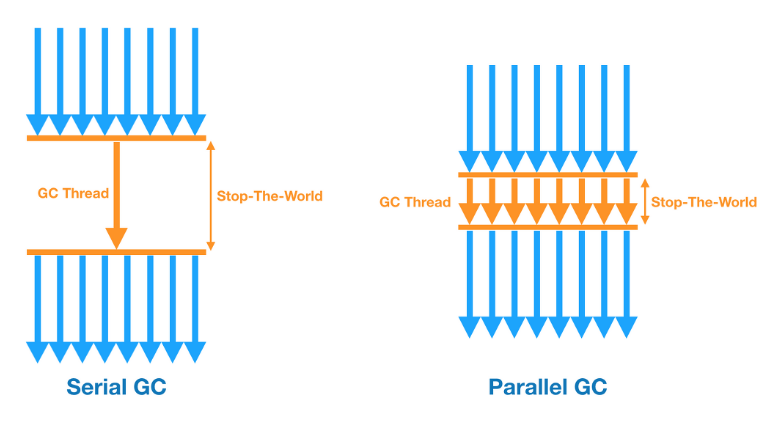

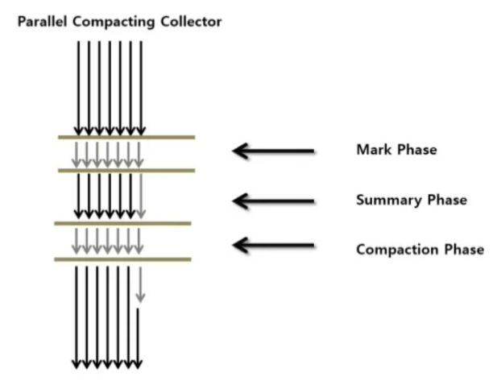
  
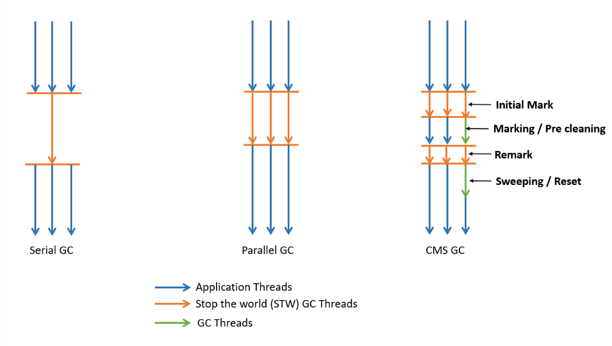

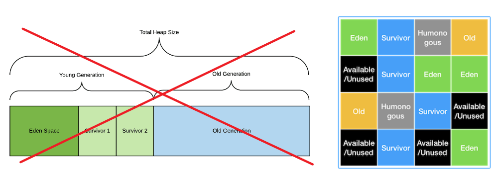

> Collection Interface 핵심 구현체에 대하여 아는데로 설명하시오.

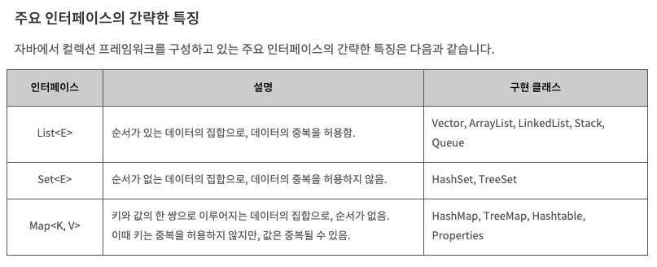

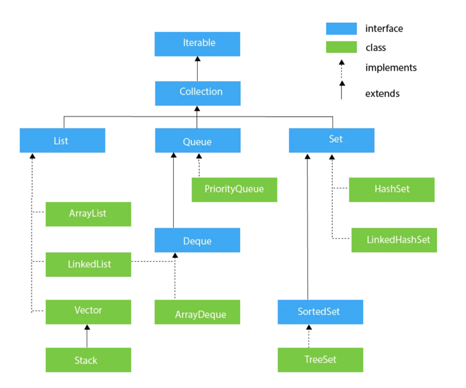

> Thread Safe 한 리스트 생성 방법은?

- Collections.synchronizedList
- https://docs.oracle.com/javase/6/docs/api/java/util/Collections.html#synchronizedList(java.util.List)

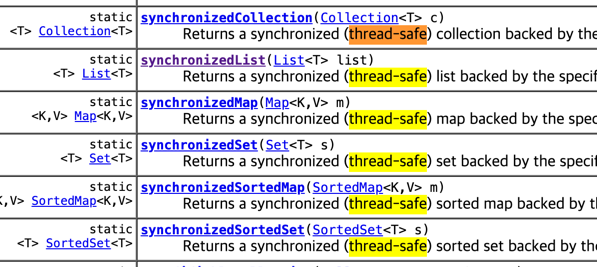

> Java Reflection 에 대하여 아시나요?

- 구체적인 클래스 타입을 알지 못해도, 그 클레스의 메소드, 타입, 변수들을 접근할 수 있도록 해주는 자바 API  
- 동적으로 클래스를 사용해야할 때 필요 (코드 작성 시점에 어떤 클래스를 사용해야할 지 모르는 경우, 런타임 시점에 클래스를 가져와서 실행해야 하는 경우 사용

> ThreadLocal 에 대하여 아시나요?

- ThreadLocal 변수를 선언하면 `멀티 스레드` 환경에서 각 `스레드마다 독립적인 변수`를 가지고, `get()`, `set()` 메소드를 통해 값에 대해 접근 가능하다

> Primitive Type 과 Wrapper Class 의 사용 기준이 있나?

- Java 데이터 타입의 종류로 크게 Primitive Type (기본형, byte/int/long/double 등 ) 과 Reference Type (참조형) 이 있음
- Reference Type 에는 Primitive Type 에 대한 Wrapper Class (Byte/Integer/Long/Double 등) 도 포함됨.
- `Wrapper Class` 의 특징
  - 산술 연산 불가
  - `null 로 초기화 불가`
- `Wrapper Class 를 써야 하는 경우`
  - DB 연동 시 `null 이 필요한 경우`
  - 매개변수로 객체형이 요구될 때
  - 기타 등등

#### Java 8

> Java 8 의 특징에 대하여 설명하시오

- Lambda expressions
- Method reference
- Functional interface
- Stream
- Parallel stream
- Default method
- Optional
- CompletableFuture
- New date/time APIs

> Stream 중간 연산자 / 최종 연산자

- 중간 연산자에 대하여 아는 데로 말하시오
  - 자르기(skip, limit)
  - 필터(filter, distinct)
  - 정렬(sorted)
  - 매핑(map, flatMap)
  - 기타(peek)
- 최종 연산자
  - 반복(forEach, forEachOrdered)
  - 배열로 변환(toArray)
  - 조건 검사(allMatch, anyMatch, noneMatch)
  - 조건 일치요소 찾기(findFirst, findAny)
  - 통계(count, sum, average, max, min)
  - 리듀스(reduce)
  
> Java 8 Map 과 Flatmap 의 차이를 설명하시오

- Function<? super T, ? extends R>
- Function<? super T, ? extends Stream<? extends R>>
  - 중첩구조를 한 단계 제거하고 단일 컬렉션으로 만들어 주는 역할을 하며, 이러한 작업을 Flattening 이라고 함

> Functional Interface (아래 중 택 1) 에 대하여 설명하시오 (인자, 리턴 값, 실행메소드 이름)

- Runnable

```java
public interface Runnable {
    public abstract void run();
}
```

- Supplier<T>

```java
public interface Supplier<T> {
    T get();
}
```

- Consumer<T>

```java
public interface Consumer<T> {
    void accept(T t);
 
    default Consumer<T> andThen(Consumer<? super T> after) {
        Objects.requireNonNull(after);
        return (T t) -> { accept(t); after.accept(t); };
    }
}
```

- Function<T, R>

```java
public interface Function<T, R> {
    R apply(T t);
 
    default <V> Function<V, R> compose(Function<? super V, ? extends T> before) {
        Objects.requireNonNull(before);
        return (V v) -> apply(before.apply(v));
    }
 
    default <V> Function<T, V> andThen(Function<? super R, ? extends V> after) {
        Objects.requireNonNull(after);
        return (T t) -> after.apply(apply(t));
    }
 
    static <T> Function<T, T> identity() {
        return t -> t;
    }
}
```

- Predicate<T>

```java
public interface Predicate<T> {
    boolean test(T t);
 
    default Predicate<T> and(Predicate<? super T> other) {
        Objects.requireNonNull(other);
        return (t) -> test(t) && other.test(t);
    }
 
    default Predicate<T> negate() {
        return (t) -> !test(t);
    }
 
    default Predicate<T> or(Predicate<? super T> other) {
        Objects.requireNonNull(other);
        return (t) -> test(t) || other.test(t);
    }
 
    static <T> Predicate<T> isEqual(Object targetRef) {
        return (null == targetRef)
                ? Objects::isNull
                : object -> targetRef.equals(object);
    }
}
```
  
> JPA

> JPA 엔티티 생명주기 4가지에 대하여 설명하시오
  
- 비영속, 영속, 준영속, 삭제
  - 비영속(new/transient) : 영속성 컨텍스트와 관계가 없는 상태
  - 영속(managed) : 영속성 컨텍스트에 저장된 상태
  - 준영속(detached) : 영속성 컨텍스트에 저장되었다가 분리된 상태
  - 삭제(removed) : 삭제된 상태
  
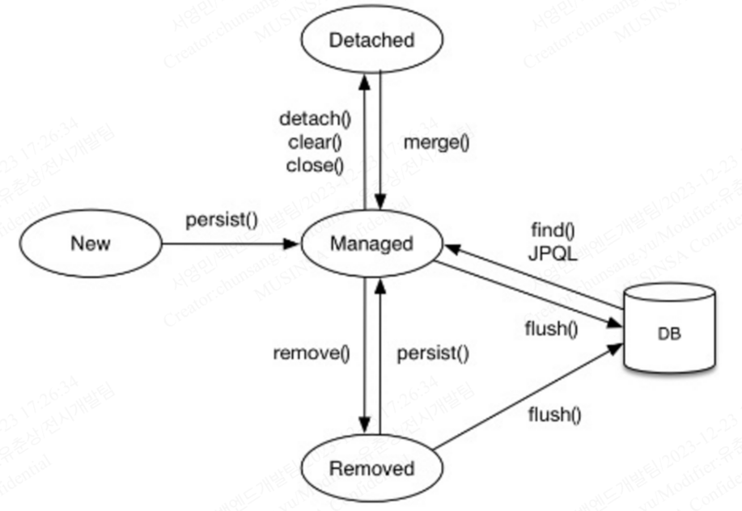

> JPA 1차 캐시와 2차 캐시의 차이점
  
- 1차 캐시는 영속성 컨텍스트
- 2차 캐시는 애플리케이션 범위의 캐시 지원

> JPA N+1 문제 및 해결방안
  
- JPQL 패치 조인 사용(Join Fetch)
- @EntityGraph 
  - 인터페이스에 어노테이션으로 사용 (특정 연관관계만 페치 가능)
- @BatchSize + FetchType.EAGER

> Gradle

- dependencty 항목에서 implemetation vs compile(or api)
  - https://hack-jam.tistory.com/13 
  -  Gradle 3.0부터는 Compile이 deprecated -> api 로 대체
  - A <- B <- C 의 연관 모듈에서 A 가 수정되는 경우
    - implementation 은 B 만 리빌드 ( 직접 의존 모듈만 리빌드 )
    - compile/api 는 B, C 둘다 리빌드 ( 직간접 의존 모듈 전부 리빌드 )
  - implementation 의 장점
    - 빠르다 -> 변경시 리빌드(리컴파일) 을 적게함
    - API 노출
      - comnpile/api 를 사용하게 되면 연결된 api 가 노출이 됨
      - 불필요한 api 노출을 막기 위해서 implementation 사용 권장 (필요시 api 사용)

---

## Spring framework

> 스프링 프레임워크의 주요 특징에 대하여 간락히 설명하시오

- POJO (Plain Old Java Object)
  - POJO란 특정 기술에 종속되지 않는 순수한 자바 객체
  - 진정한 POJO란 객체지향적인 원리에 충실하면서, 환경과 기술에 종속되지 않고 필요에 따라 재활용될 수 있는 방식으로 설계된 오브젝트를 말한다.
- 제어 역전 (IoC, Inversion Of Control)
- 의존성 주입 (DI, Dependency Injection)
- 관점지향 프로그래밍 (AOP, Aspect Oriented Programming)
  
> Spring MVC 요청 라이프사이클에 대하여 설명해주세요. (Spring MVC 작동 원리)

1. 클라이언트는 URL을 통해 요청을 전송한다.
2. 디스패처 서블릿은 핸들러 매핑을 통해 해당 요청이 어느 컨트롤러에게 온 요청인지 찾는다.
3. 디스패처 서블릿은 핸들러 어댑터에게 요청의 전달을 맡긴다.
4. 핸들러 어댑터는 해당 컨트롤러에 요청을 전달한다.
5. view 반환
   6. 컨트롤러는 비지니스 로직을 처리한 후에 반환할 뷰의 이름을 반환한다.
   7. 디스패처 서블릿은 뷰 리졸버를 통해 반환할 뷰를 찾는다.
   8. 디스패처 서블릿은 컨트롤러에서 뷰에 전달할 데이터를 추가한다.
   9. 데이터가 추가된 뷰를 반환한다.
6. 데이터 반환 (ex) json
   7. HttpMessageConverter 
      8. 단순 문자열 : StringHttpMessageConverter
      9. 객체 : MappingJackson2HttpMessageConverter

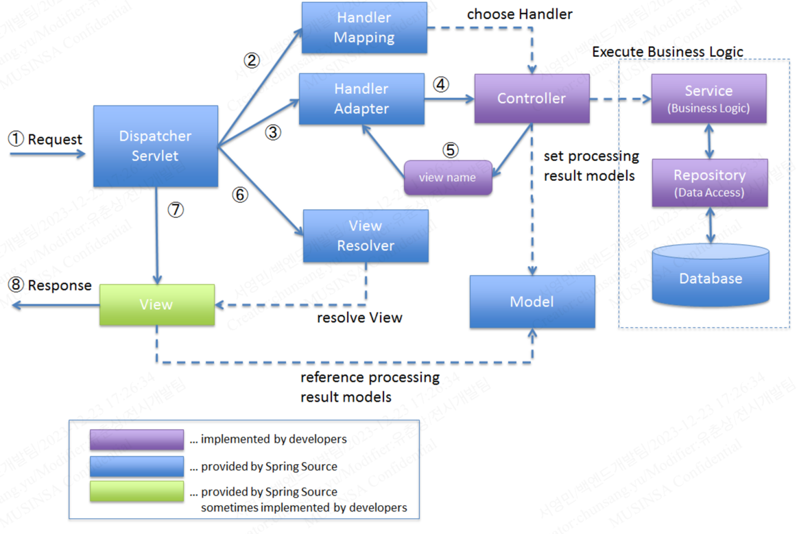

> DI (Dependency Injection) 의존 관계 주입 방법 종류 및 선호하는 방법 과 그 이유

- Field injection (@Autowired)
- Setter based injection
- Constructor based injection
  - Constructor based injection (생성자 주입) 방식을을 권장하는 이유는? 
    - 순환 참조 방지(컴파일 단계 오류 발생)
    - 불변성(필드를 `final` 로 선언 가능)
    - 테스트 용이성

> Bean scope 종류에 대하여 말하시오

- Singleton (Default) : 스프링 컨테이너에 의해 한 번 생성
- Prototype : 의존성 관계의 빈이 주입될 때마다 새로운 객체 생성
- Request : HTTP 라이프 사이클 마다 한개의 빈을 사용, web-aware 컨택스트에서만 사용가능 - ex. Applicaiton context
- Session : HTTP 세션마다 하나의 빈을 사용, web-aware 컨택스트에서만 사용가능 - ex. Applicaiton context
- Global Session 
  - Singleton : 스프링 컨테이너에 의해 한 번 생성 
  - Prototype : 의존성 관계의 빈이 주입될 때마다 새로운 객체 생성
- 싱글톤 스코프에서 프로토타입 스코프를 필드로 가지고 있으면 프로토타입 스코프의 객체는 처음 주입된 객체를 계속 가지고 있음
  - 프로토타입에 맞게 하고 싶으면 
    - proxyMode = ScopedProxyMode.INTERFACES
    - ObjectProvider<>
    - ScopedProxyMode 이 POJO 를 유지하기에 ScopedProxyMode 를 추천

> AOP (Aspect Oriented Programming, 관점 지향 프로그래밍) 구성요소

- Target
  - 부가 기능을 제공할 대상
- Advice
  - 어드바이스는 타겟에 제공할 부가기능을 담고 있는 모듈이다.
  - Advice 에 대한 답변이 나온다면, Advice 의 종류에 대하여 말하시오 
    - Before(이전)
    - After(이후)
    - AfterReturning(정상적 반환 이후)
    - AfterThrowing (예외 발생 이후)
    - Around(메소드 실행 전후)
- JoinPoint
  - 어드바이스가 적용될 수 있는 위치를 말한다.
  - 타겟 객체가 구현한 인터페이스의 모든 메서드는 조인 포인트가 된다.
- PointCut
  - 어드바이스를 적용할 타겟의 메서드를 선별하는 정규표현식이다.
  - 포인트컷 표현식은 execution으로 시작하고 메서드의 Signature를 비교하는 방법을 주로 이용한다.
- Aspect
  - 애스펙트 = 어드바이스 + 포인트컷
  - 애스펙트는 싱글톤 형태의 객체로 존재한다.
- Advisor
  - 어드바이저 = 어드바이스 + 포인트컷
- Weaving
  - 위빙은 포인트컷에 의해서 결정된 타겟의 조인 포인트에 부가기능(어드바이스)를 삽입하는 과정을 뜻한다.

  
> Spring AOP 특징

- Spring은 프록시 기반 AOP를 지원한다.
  - Spring은 타겟(target) 객체에 대한 프록시를 만들어 제공한다.
  - 프록시는 어드바이스를 타겟 객체에 적용하면서 생성되는 객체이다.
- 프록시(Proxy)가 호출을 가로챈다(Intercept)
- Spring AOP는 메서드 조인 포인트만 지원한다.
  - Spring은 동적 프록시를 기반으로 AOP를 구현하므로 메서드 조인 포인트만 지원한다.

> 필터(Filter)와 인터셉터(Interceptor)의 차이에 대하여 말하시오.

- 필터(Filter)
  - DispatcherServlet 앞단에서 정보 처리
  - init(), doFilter(), destroy()
  - Request, Response 조작 가능
  - doFilter 로 필터 체이닝으로 동작
  - 사용처
    - 인증/인가
    - 요청에 대한 로깅
    - 이미지/데이터 압축 및 문자열 인코딩
    - Spring과 분리되어야 하는 기능
- 인터셉터(Interceptor)
  - DispatcherServlet 에서 Handler(Controller)로 요청이 가기 전에 실행
  - Spring context 에서 실행
  - preHandler, postHandler, afterCompletion
  - 리턴 값이 true/false 로 true 인경우에 다음 인터셉터 호출 및 컨트롤러로 요청이 전달된다
  - 인터셉터 대신에 컨트롤러에 적용할 부가기능을 AOP로 대신할 수 있다
    - 하지만, 컨트롤러는 타입과 실행 메소드가 모두 제각각이라 포인트컷(적용할 메소드 선별)의 작성이 어렵다.
    - 컨트롤러는 파라미터나 리턴 값이 일정하지 않다.
  - 사용처
    - 세부적인 보안 및 인증/인가 공통 작업
    - API 호출에 대한 로깅 또는 검사
    - Controller로 넘겨주는 정보(데이터)의 가공


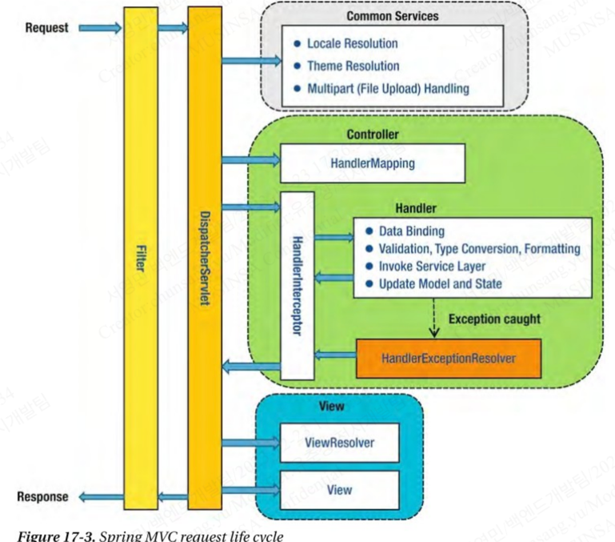

---

## Database

> 트랜잭션 격리수준(Transaction Isolation level) 에 대하여 설명하시오

- READ UNCOMMITED(dirty read)
  - READ UNCOMMITTED는 커밋하지 않은 데이터 조차도 접근할 수 있는 격리 수준
- READ COMMITTED(un-repeatable read)
  - 커밋된 데이터만 조회할 수 있다
  - Phantom Read에 더해 Non-Repeatable Read(반복 읽기 불가능) 문제까지 발생한다.
    - 반복 읽기를 수행하면 다른 트랜잭션의 커밋 여부에 따라 조회 결과가 달라질 수 있다 (반복읽기 불가능)
- REPETABLE READ(phantom read)
  - 일반적인 RDBMS는 변경 전의 레코드를 언두 공간에 백업해둔다. 그러면 변경 전/후 데이터가 모두 존재하므로, 동일한 레코드에 대해 여러 버전의 데이터가 존재한다고 하여 이를 MVCC(Multi-Version Concurrency Control, 다중 버전 동시성 제어)라고 부른다
  - REPEATABLE READ는 MVCC를 이용해 한 트랜잭션 내에서 동일한 결과를 보장하지만, 새로운 레코드가 추가되는 경우에 부정합이 생길 수 있다.
  - Mysql 에도 팬텀리드가 거의 발생하지 않으나 베타락을 사용한 경우 발생할 수 있다
- SERIALIZABLE
  - 여러 트랜잭션이 동일한 레코드에 동시 접근할 수 없다
  - 트랜잭션이 순차적으로 처리되어야 하므로 동시 처리 성능이 매우 떨어진다.
- https://mangkyu.tistory.com/299

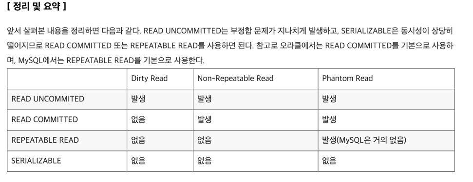

> MySQL Storage Engine (MyISAM vs InnoDB) 의 차이점에 대하여 간략히 설명하시오

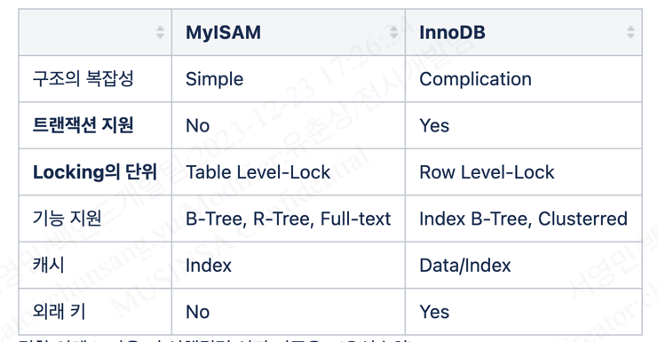

> 결합 인덱스 사용 시 선행컬럼 선정 기준은? (우선순위)

- 1단계: 항상 사용하는가? (빈번히 사용되는가?)
- 2단계: 항상 '='로 사용하는가?
- 3단계: 어느 것이 더 좋은 분포도를 가지는가? 
  - 분포도의 값이 낮으면서(같은 값이 적으면서) 데이터가 일정하게 분포되어 있는지
- 4단계: 자주 정렬되는 순서는 무엇인가?
- 5단계: 부가적으로 추가시킬 컬럼은 어떤 것으로 할 것인가?

> 쿼리 실행 순서

- **FROM** → ON → JOIN → **WHERE** → **GROUP BY** → **HAVING** → **SELECT** → DISTINCT → **ORDER BY**

> char vs varchar

- https://goodgid.github.io/JS-char-vs-varchar/
- char(10) 으로 설정 후 4글자 문자를 입력하면 남는 공간은 어떻게 처리되나? 

> partitioning 과 sharding 은 다른건가요? 

- 다르다면 어떻게 다른건가요?
  - https://www.google.com/search?q=partitioning+sharding
  - 파티셔닝
    - 파티셔닝은 매우 큰 테이블을 여러개의 테이블로 분할하는 작업이다
    - 데이터는 물리적으로 여러 테이블로 분산하여 저장
    - 하나의 테이블에 접근하는 것과 같이 사용
    - 종류
      - List Partitioning
        - 데이터 값이 특정 목록에 포함된 경우 데이터를 분리한다
      - Range Partitioning
        - 데이터를 특정 범위 기준으로 분할할 때 사용한다
      - Hash Partitioning
        - 해시 함수를 사용하여 데이터를 분할할 때 사용한다
      - Composite Partitioning
        - 파티셔닝 종류 중 두개 이상을 사용하는 방식이다.
  - 샤딩
    - 샤딩은 동일한 스키마를 가지고 있는 여러대의 데이터베이스 서버들에 데이터를 작은 단위로 나누어 분산 저장하는 기법이다
    - 차이점은 파티셔닝은 모든 데이터를 동일한 컴퓨터에 저장하지만, 샤딩은 데이터를 서로 다른 컴퓨터에 분산한다는 점
    - 쿼리 성능 향상과 더불어 부하가 분산되는 효과

> 리플리케이션(Replication) vs 클러스터링(Clustering)

- 리플리케이션
  - 특징
    - 여러 개의 DB를 권한에 따라 수직적인 구조 ( Master - Slave ) 로 구축하는 방식이다.
    - 비동기 방식으로 노드들 간의 데이터를 동기화한다.
    - 장점 : 비동기 방식으로 데이터가 동기화되어 지연 시간이 거의 없다.
    - 단점 : 노드들 간의 데이터가 동기화되지 않아 일관성있는 데이터를 얻지 못할 수 있다.
  - Replication 이란 두 개 이상의  DB 시스템을 Master / Slave 로 나눠서 동일한 데이터를 저장하는 방식이다.
  - Master DB 에는 데이터의 수정사항을 반영만 하고 Replication을 하여 Slave DB 에 실제 데이터를 복사한다.
  - ex ) 저장된 데이터가 손실되면 어떻게 대응할까 ?
    - 서버가 죽었으 때 서비스 제공 문제 -> 서버를 여러 대 두는 Clustring으로 해결 할 수 있다.
    - 데이터 손실문제 -> 저장소를 복제하는 Replication 방식으로 해결할 수 있다.
  - Master DB 역할 : 웹 서버로 부터 데이터 등록 / 수정 / 삭제 요청시 바이너로그를 생성하여 Slave 서버로 전달하게 된다.
  - Slave DB 역할 : Master DB로 부터 전달받은 바이너리로그를 데이터로 반영하게 된다
- 클러스터링
  - 특징
    - 여러 개의 DB를 수평적인 구조로 구축하여 Fail Over한 시스템을 구축하는 방식이다.
    - 동기 방식으로 노드들 간의 데이터를 동기화한다.
    - 장점 : 1 개의 노드가 죽어도 다른 노드가 살아 있어 시스템을 장애없이 운영할 수 있다.
    - 단점 : 여러 노드들 간의 데이터를 동기화하는 시간이 필요하므로 Replication에 비해 쓰기 성능이 떨어진다.
  - DB Clustering 이란 DB를 여러개의 서버가 나눠서 처리하도록 하는 것이다.
  - 서버 한 대가 죽어도 대비가 가능하다.
  - 여러 데이터베이스 서버로 부하를 분산시켜 사용자의 요청을 더 많이 수용할 수 있다. ( 로드 밸런싱 )
  - 여러 대의 데이터베이스 서버를 가지므로 높은 가용성을 보장한다. ( 높은 가용성 )
  - 종류
    - Active - Active Clustering
      - 데이터베이스 서버를 Active ( 동작중 ) 상태로 두는 방식이다.
      - 장점
        - 서버 하나가 죽어도 다른 서버가 역할을 바로 수행하여 중단되는 시간이 없다. ( 무중단 서비스 가능 )
        - 같이 사용되어 CPU와 메모리 이용률을 늘릴 수 있다. ( 성능적인 측면에서 이득 )
      - 단점
        - 저장소 하나를 공유하면 병복현상이 발생될 수 있다.
        - 두 대의 서버를 동시에 운용해야하기 때문에 비용이 많이 든다.
    - Active - StandBy Clustering
      - 데이터베이스 서버 하나는 Active ( 동작중 ) , 하나는 Standby 상태로 두는 방식이다.
      - 장점
        - Active - Active에 비해 적은 비용이 든다 ( 비용 절감 )
      - 단점
        - 서버가 다운되었을 경우 다른 서버가 Active로 전환되는데 시간이 들어서 서버가 중단되는 시간이 있다.

> primary key 와 unique key 를 어떻게 구분해 사용하나요?

- 기본키
  - null 불가
  - 테이블 row 고유키로 사용
- 유니크키
  - null 가능

---

## Network

> HTTP Status Codes

- 200
- 201 Created
- 204 No Content
- 205 Reset Content
- 3xx : 리다이렉션 관련
- 400 : bad request 
- 401 : 비인증
- 403 : 권한 없음
- 404 : 낫파운드
- 406 : URI를 호출할 때 Accept Header에 명시된 형식을 생성하지 못하는 경우에 발생 
  - json 인데 xml 로 호출하거나
- 408 : 타임아웃
- 500 : 서버에러
- 502 : Bad gateway
- 504 : gateway timeout

> HTTP Methods

- https://developer.mozilla.org/ko/docs/Web/HTTP/Methods
- GET
- HEAD
  - URI 로 전달된 내용은 전달하지 않음
  - 헤더만 전달 받는다
  - 상태확인에 주로 사용됨 (리소스 존재 여부 등)
- POST
- PUT
- PATCH
- DELETE
- OPTIONS
  - 지원하는 요청 방식을 확인할 때 사용
- PUT Method vs PATCH Method 의 차이점을 설명하시오
  - 리소스 전체 vs 리소스 일부

> REST API 에 대하여 설명하시오.

- HTTP URI(Uniform Resource Identifier)를 통해 자원(Resource)을 명시하고
- HTTP Method(POST, GET, PUT, DELETE)를 통해 해당 자원에 대한 CRUD Operation을 적용하는 것을 의미
- 규칙
  - 소문자 사용
  - 언더바 대신 하이픈
  - 마지막에 / 포함하지 않는다
  - 파일 확장자는 포함하지 않는다
  - 명사를 사용
  - 복수형을 사용
- RESTful 이란?
  - rest api 설계 규칙을 올바르게 지킨것
  - 헤이티오스 까지 ?

> HTTP2.0 에 대하여 아시나요? 아신다면 주요 특징과 HTTP/1.1 과의 차이는?

- http 1.1
  - 데이터는 문자열로 전송한다.
  - 연결당 하나의 요청과 응답을 처리한다. 그래서 동시전송 문제와 다수의 리소스를 처리하기에 속도와 성능의 문제를 가지고 있다.
  - *HOL-Blocking 발생, *RTT(Round Trip Time)의 증가
  - 매 요청시 마다 쿠키 정보를 헤더에 포함시키고, 중복된 헤더 값을 전송한다.
- http 2.0
  - 데이터는 바이너리로 인코딩하여 압축해서 전송한다.
  - Multiplexed Streams 방식이 도입되어 한번의 연결으로 여러개의 메세지를 동시에 주고 받을 수 있다. 그러므로 HOL-Blocking이 발생하지 않는다.
  - Stream Prioritization : 요청 리소스간 우선순위를 설정하여 응답을 빨리 받을 수 있다.
  - Header Compression : 헤더 정보를 *HPACK 압축 방식을 이용하여 압축 전송한다.
  - Server Push : 클라이언트 요청 없이 서버에서 리소스를 보내줄 수 있다.
- http 3.0
  - quic 프로토콜 사용
  - UDP 사용
  - 전송순서 보장 x 

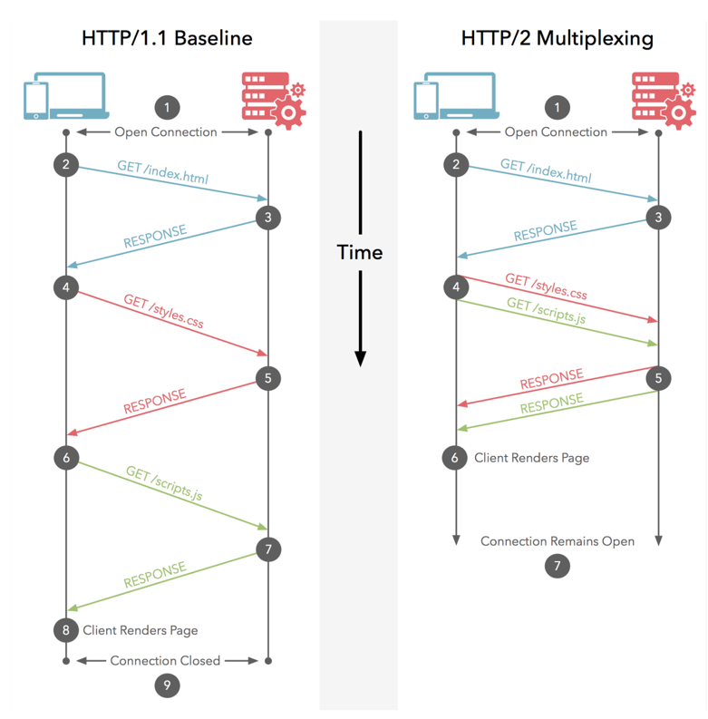

> 로드 밸런싱(Load Balancing) 이 왜 필요한지에 대하여 간략히 설명하시오

- 로드밸런싱은 여러 대의 서버를 두고 서비스를 제공하는 분산 처리 시스템에서 필요한 기술
- Scale-out의 방식으로 서버를 증설 시 여러 대의 서버로 트래픽을 균등하게 분산해주는 로드밸런싱이 반드시 필요

> 무신사 스토어 사이트 URL 값을 브라우저에 입력하였을 때 어떤 일들이 일어나는지 설명하시오

- 브라우저 → 프로토콜 스택, LAN 어댑터 → 허브, 스위치, 라우터 → 액세스 회선, 프로바이더 → 방화벽, 게이트웨이, 캐시서버 → 웹 서버 → WAS

> 서버 사이드 랜더링(SSR) 와 클라이언트 사이드 랜더링(CSR) 에 대하여 설명하시오

> CDN 이란 무엇이고, 어떤 경우에 사용합니까?

- Content Delivery Network
- 느린 응답속도 / 다운로딩 타임 을 극복하기 위한 기술
- 동작원리
  - 최초 요청은 서버로 부터 컨텐츠를 가져와 고객에게 전송하며 동시에 CDN캐싱장비에 저장한다
  - 두번째 이후 모든 요청은 CDN 업체에서 지정하는 해당 컨텐츠 만료 시점까지 CDN캐싱장비에 저장된 컨텐츠를 전송한다.
  - 자주사용하는 페이지에 한해서 CDN장비에서 캐싱이 되며, 해당 컨텐츠 호출이 없을 경우 주기적으로 삭제된다.
  - 서버가 파일을 찾는 데 실패하는 경우 CDN 플랫폼의 다른 서버에서 콘텐츠를 찾아 엔드유저에게 응답을 전송한다.
  - 콘텐츠를 사용할 수 없거나 콘텐츠가 오래된 경우, CDN은 서버에 대한 요청을 프록시로 작동하여 향후 요청에 대해 응답할 수 있도록 새로운 콘텐츠를 저장한다.
- CDN 캐싱 방식
  - Static Caching
    - Origin Server에 있는 Content를 운영자가 미리 Cache Server에 복사
  - Dynamic Caching
    - Origin Server에 있는 Content를 운영자가 미리 Cache Server에 복사하지 않음
    -  사용자가 Content를 요청시 해당 Content가 없는 경우 Origin Server로 부터 다운로드 받아 전달한다.

> SOP(Same-Origin Policy) 와 CORS (Cross-Origin Resource Sharing) 에 대해 아는대로 설명해 주세요.

- SOP 
  - 동일 출처 정책
  - 동일 출처 판단 기준 : 프로토콜, 호스트, 포트
  - 모든 처리가 같은 도메인 내에서 일어난다는 것
- CORS
  - 교차 출처 리소스 공유
  - 리소스 호출이 허용된 출처를 서버가 명시해놓으면, 출처가 다르더라도 요청과 응답을 주고 받을 수 있도록 만들어놓은 정책이 바로 CORS이다

- https://www.google.com/search?q=sop+cors

---

## Architecture

> MSA 적용 시 분리된 두 개의 데이터 저장소에서 Transaction 을 처리하는 방법은?

- SAGA 패턴사용
  - Choregraphy-based SAGA (코레오그래피 사가)
    - 순차적으로 이벤트가 전달되면서 트랜잭션이 관리되는 방식이다.
    - 이벤트는 RabbitMQ, Kafka와 같은 메시지 큐 미들웨어를 사용해서 비동기 방식 혹은 분산 처리 형태로 전달할 수 있다.
    - 코레오그레피 방식의 경우 에러가 발생했을 때 현재 트랜잭션 상태에 대해 파악하기 어렵다는 단점이 있다.
    - 확장이 어렵다
  - Orchestration-based SAGA (오케스트레이션 사가)
    - 서비스가 Event를 직접 구독하지 않고, Saga Orchestrator에서 Event를 구독한 후 각 서비스를 호출하여 트랜잭션을 관리하는 방식이다.
    - 트랜잭션에 관여하는 모든 서비스는 Orchestrator에 의해 트랜잭션을 수행하고 결과를 Orchestrator에게 전달한다.
    - 오케스트레이션 방식은 현재 트랜잭션의 상태를 파악하기가 용이하고 각 서비스의 구현이 비교적 간단해진다.
    - 단, 추가적인 인프라를 사용해야 한다는 단점이 있고, Orchestrator가 비즈니스 로직에 의존해선 안된다는 점을 주의해야 한다.
  
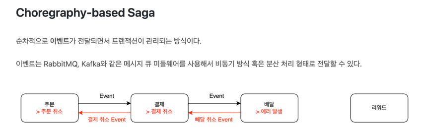

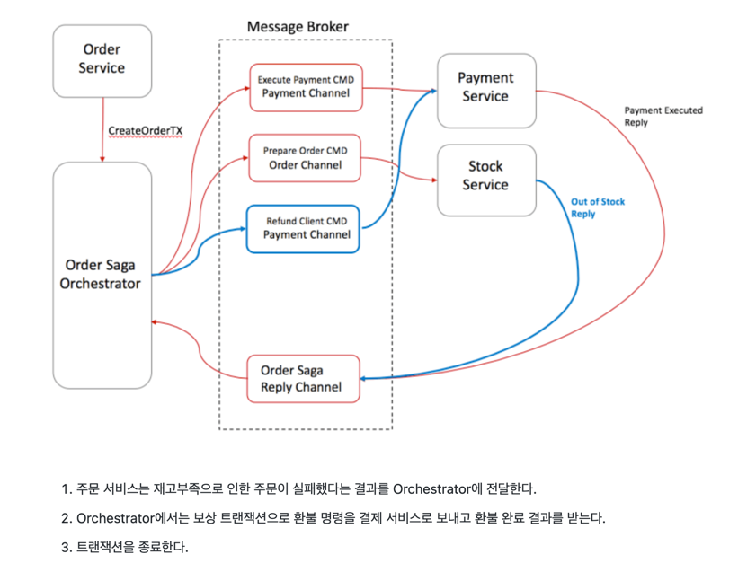

> Async 와 Non-Blocking 에 대해 설명해 주세요

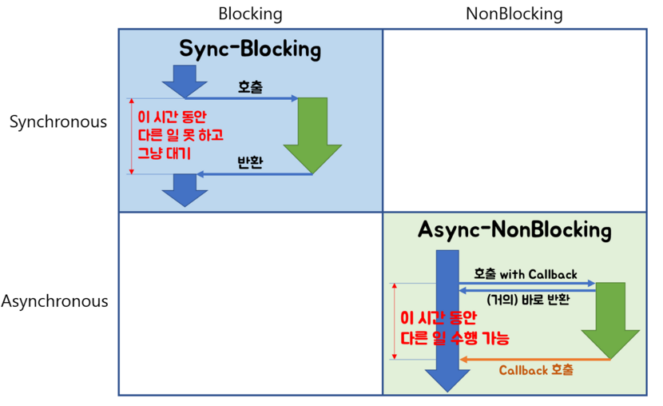

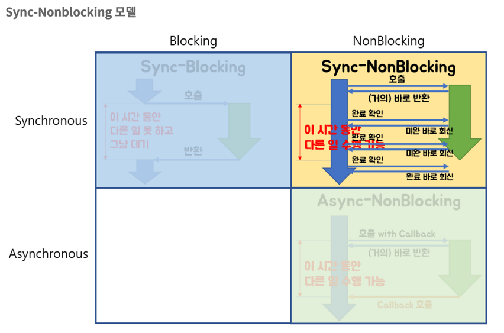

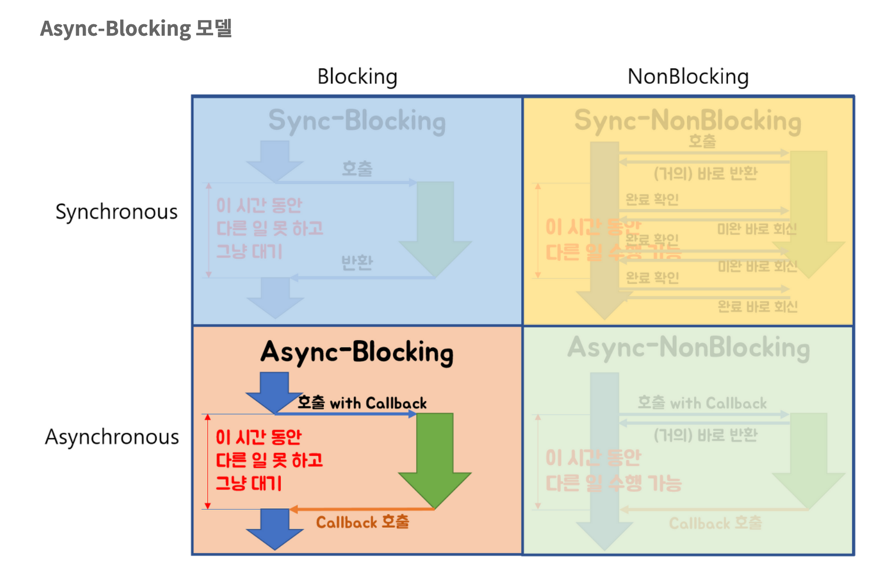

> Redis 사용 시 주의할 점

- Redis 는 In memory data store
  - 당연히 메모리 관리 잘해줘야 함
    - physical memory 이상 사용하면 swap 메모리 사용 → 느려짐
    - 지속적인 RSS 모니터링
      - RSS : 피지컬 메모리를 얼마나 쓰고 있냐, OS가 보고 있는 지표
- 큰 메모리를 사용하는 instance 하나보다는 적은 메모리를 사용하는 instance 여러 개가 안전함.
- Redis 는 Single thread
  - 동시에 여러개의 일은 처리 못함 → 그래서 오래 걸리는 일 시키면 안됨
    - 오래 걸리는 대표적 명령어
      - keys , flushall, flushdb, delete collections, get all collections
    - keys는 어떻게 대체할 수 있는가? scan 명령어를 사용하자
    - Collection의 일부만 가져오거나 큰 Collection을 작은 여러개의 Collection으로 나눠서 저장해야 한다.
- 모니터링시 봐야할 것
  - Redis info를 통한 정보에서 봐야할 정보들
    - RSS
    - Used Memory (내가 얼마나 쓰고 있나?)
    - Connction 수 (client가 몇 개나 접속하고 있나?)
    - 초당 처리 요청 수
  - System에서 봐야할 정보들
    - CPU
    - Disk
    - Network rx/tx

---

## Secure

> XSS (Cross Site Script) 공격이란 무엇이고, 어떻게 방어하나?

- 악의적인 목적을 가진 제 3자가 악성 스크립트를 삽입하여 의도하지 않은 명령을 실행시키거나 세션 등을 탈취할 수 있는 취약점
- ex) html 에 alert 넣기
- 대응방법
  - 입력 값의 길이 제한(이메일, 아이디, 패스워드 등 목적에 맞게)
  - replace 등의 함수를 이용한 치환
  - '<', '>' 와 같이 태그에 사용되는 기호를 엔티티코드로 변환
  - 입력 값에 대한 꼼꼼한 유효성 검사(반드시 서버에서 수행)
  - 불가피하게 HTML 태그 사용을 허용해야 할 경우 화이트리스트를 만들어 특정 태그 입력만 허용

> SQL Injection 이란 무엇이고, 어떻게 방어하나?

- 임의의 SQL문을 주입하고 실행되게 하여 DB가 비정상적인 동작을 하도록 조작하는 행위
- 대응방법
  - PreparedStatement
  - 특수문자 및 예약어, 함수 등 블랙리스트

---

## ETC

> 최근 관심있는 토픽이나 공부하고 있는게 있다면?

> 최근 경험한 장애

- 현상, 원인, 해결, 재발방지 등 4가지 포인트 체크. 빠진게 있다면 질문.

> 무신사에 입사해서 개선하거나 바꾸고 싶은 부분이 있다면? 혹은 이런 기능이 있으면 좋겠다?

- (후속질문) 그걸 어떤 방식으로 할건지

> 일 잘하는 사람은 어떤 사람이라고 생각하나?


---

## 설로인

>  경력 관리 및 협업

- 입사 이후, 3년 뒤 후보자의 모습, 10년 뒤 후보자의 모습에 대해 말씀해주세요.
- 수습 기간동안 어떻게 본인의 능력을 팀에게 증명해 보이시겠습니까?
- 일을 하던 중에, 다른 업무 요청이 들어온다면 어떻게 상황을 조율하시겠습니까?
- 제일 재미있게 들었던 학교 수업, 또는 최근 흥미가 있거나 재미있었던 개발 관련 소식 / 또는 해본 일중 기뻤거나 슬픈 일
- 후보자님께서 소프트웨어 엔지니어의 길을 걷기로 결심한 이유에 대해 말씀해 주세요.
- 납득가지 않는 일을 떠 맡게 되었다면, 갈등을 어떻게 해결하시겠습니까?
- 코드 리뷰에서 동료 코드의 어떤 점을 가장 중요하게 체크하시나요?
- 코드의 품질을 정의하는 후보자님만의 기준이 있습니까?
- Continuous Integration 의 중요성에 대해 설명해주세요.
- OpenJDK 는 GNU GPL 라이선스로 배포됩니다. GNU GPL 이 뭔가요?
- 정규표현식을 유용하게 사용한 경험이 있습니까? 또는 불편한 적은 없었나요?
- 저희 회사는 후보자님이 자신있어 하시는 XX 기술을 쓰지 않고 있습니다. 그 기술을 반드시 도입해야 한다고, 면접관을 어떻게 설득하시겠습니까?
- 업무 스케쥴링 하실 때, 시간 비용은 어떻게 산정하시나요?
- Agile 이 대세라고 하는데, Agile 개발 방법론에 대한 본인의 생각을 말씀해 주세요. Agile 의 단점은 없습니까?

---

> 운영체제 / 논리회로 일반

- 컴퓨터는 10진수를 2진수로 바꿔서 계산합니다. 10진수를 2진수로 바꾸는 방법과, 그 반대 방법에 대해 설명해 주시기 바랍니다.
- 컴퓨터는 소숫점 계산을 잘 못합니다. 그 이유가 무엇일까요? 어떻게 문제를 해결할 수 있을까요? 직접 구현한다면 어떻게 하시겠습니까?
- Thread 간의 데이터 공유와 Process 간의 데이터 공유의 공통점과 차이점을 설명해주세요.
- 컴퓨터가 기계어를 읽고, 실행하는 과정에 대해 설명해 주실 수 있나요?
- 운영체제가 여러 프로그램을 동시에 실행하는 원리에 대해 설명해주세요.
- 컴파일러와 인터프리터는 어떤 차이가 있을까요?
- Garbage Collection 이란 무엇일까요? Garbage Collection 방식 중 제일 잘 알고 계시는 GC를 아무거나 하나만 설명해주세요.
- Garbage collection 이 있는 언어를 원자력 발전소, 자동차 동력 제어, 인공위성, 국가 전력망 제어시스템 같은 곳에 쓸 수 있을까요? 후보자님의 생각을 말씀해 주세요.
- 지금 이용하시는 기술/언어에서 제일 마음에 드는점과 불만인 점 한가지를 말씀해주세요.
- System call 이 뭔가요? System call 에 대해 설명해주세요.
- 바이트코드와 기계어의 차이에 대해 설명해주세요.
- Thread safety 란 뭔가요? 어떻게 구현해야 Thread safe 한 코드를 만들 수 있나요?
- bytecode 기반 언어는 디컴파일에 특히 취약하다는 문제가 있는데, 언어를 바꾸지 않고 이를 해결할 방법이 없을까요?
- 파이프(|) 란 무엇이고, 어떻게 동작하는지 설명해주세요.

---

> 네트워크

- Socket 으로 바로 통신하는 것 대비 HTTP 는 비효율적인데도 왜 많은 앱들은 HTTP 를 쓰는 걸까요?
- OSI Layer 7 또는 TCP Model 에 대해 설명해주세요.
- 차세대 프로토콜로 논의중인 HTTP/3 은 UDP 기반의 QUIC 이라는 기술로 구현되어 있습니다. UDP 는 TCP 대비 안정성이 떨어지는 프로토콜이라고 하는데, 그럼에도 왜 UDP 를 채택한 걸까요?
- SSL (또는 TLS) 가 어떻게 동작하는지 말씀해주세요.
- HTTP 는 Stateless (상태가 없는) 통신 프로토콜이라고 합니다. 따라서, 상태가 없다면 가령 HTTP 를 쓰는 서비스는 매번 로그인을 해 줘야 하거나 사용자 정보를 저장하는 일이 불가능합니다. 그런데 실제론 그렇지 않죠. 어떻게 이런 불편함을 해소했을까요?
- 웹 브라우저에 https://www.google.com URL 을 입력 후 enter 를 쳤을 때 일어나는 과정을 최대한 상세하게 설명해주세요.
- HTTP(s) 프로토콜에서 바이너리 데이터를 전송하는 방식에 대해 설명해주세요.
- Socket 으로 웹 페이지를 크롤링하는 HTTP 클라이언트를 직접 구현해야 한다면, 어떻게 하시겠습니까?

---

> 데이터베이스

- noSQL 과 RDB 의 특징, 차이에 대해 말씀해주세요. 어느 상황에 어떤 데이터베이스를 쓰는게 좋겠습니까?
- 데이터베이스가 자료를 빠르게 검색하기 위해 어떤 일을 할까요? 최대한 상세하게 설명해주세요.
- RDBMS 의 여러 JOIN 중 아무거나 하나 골라서, 그림으로 설명해 주실 수 있습니까?
- 데이터베이스 샤딩 / 파티셔닝에 대해 설명해주세요.
- 데이터베이스가 Index 를 이용해 자료를 빠르게 검색하는 과정을, 우리 할머니도 알아들을 수 있도록 설명해 주시겠어요?
- Stored procedure 를 이용한 시스템을 어떻게 유지보수 할 수 있습니까? Stored procedure 의 장점과 단점에 대해 말씀해 주세요.
- Optimistic Locking(낙관적 락) 과 Pessimistic Locking(비관적 락) 에 대해 설명해주세요. 각각의 락을 사용할 상황 또는 제품 사례를 말씀해주세요.
- 어떤 서비스의 이용자 테이블이 있다고 가정합시다. 이용자 id 를 여러 테이블에서 FK 로 참조하고 있습니다. 그런데 이용자 테이블에 환경설정, 개인정보 등 정보를 한데 저장하다보니 Column 이 40개가 넘게 있는 상태입니다. 문제를 진단해 주시고, 해결 방안도 제시해 주시기 바랍니다.
- Slow query 를 발견하고, 수정한 경험에 대해 말씀해 주세요.
- 저희는 도축장에서 전달받은 원육을 소매점에 도매하는 서비스를 운영하고 있습니다. 여기서, 원육과 소매점을 어떻게 테이블로 모델링 하시겠습니까?
- 어플리케이션의 문자열(String) 을 데이터베이스에 저장하기 위해 고려해야 할 사항에는 어떤 점이 있을까요?
- Big data 를 다루려면 RDBMS 보다 NoSQL 이 더 좋다는 말이 많습니다. 그렇다면 large data set 에는 항상 NoSQL 만 써야 할까요? 반드시 RDBMS 만을 이용해 large data set 을 다루려면 어떻게 해야 할까요?
- 실 서비스의 데이터를 조작하고, 또 조회해야 하는 Admin app 을 만들어야 한다면, 어떻게 구현하시겠습니까?
- 데이터 마이그레이션 기간 동안 서비스 순단을 최소한으로 하고 싶습니다. 이런 요구사항에 맞는 테이블을 어떻게 설계하시겠습니까?
- (JPA 경험자 한정) JPA 를 이용할 때, JPQL 을 쓰는 경우가 종종 있는데, JPQL 을 쓰시며 좋았던 점과 불편했던 점을 말씀해 주세요.
- (JPA 경험자 한정) JPA 의 @Entity 란 뭔가요? 도메인 객체와 Entity 객체를 각각 어떻게 정의하시겠습니까?

---

> 자료 구조 및 알고리즘

- 지금 사용하시는 스마트폰의 화면을 캡쳐하는 프로그램을 만들어야 한다면 어떻게 하시겠습니까?
- 전화번호와 같은 민감한 정보를 어떻게 저장하는게 좋을까요? 관리자조차 모르게 저장하고 싶다면?
- 암호화란 무엇일까요? 알고 계신 암호화 방식 아무거나 하나만 설명해주세요.
- 어떤 알고리즘을 도입하기 전에, 성능을 판별해 보고자 합니다. 어떤 방법을 활용해, 어떤 기준으로 알고리즘의 효율을 판단하시겠습니까?
- 공개 키 암호화와 비밀 키 암호화에 대해 설명해주세요.
- 캡슐화에 대해 설명해주세요.
- 캐시란 뭐고, 어떤 목적으로 쓰는 건가요?
- List 와 Set 의 차이에 대해 설명해주세요.
- 이진 탐색의 최선 / 최악의 경우에 대해 말씀해주세요.
- 손실 압축과 무손실 압축의 차이에 대해 설명해주세요.
- RSA 로 공개 키를 만들 때, 키 길이를 정하는 기준이 있습니까? 키 길이를 길게 하면 암호화 문제를 완벽 해결할 수 있나요?
- 순환 Queue 를 만드려면 어떻게 하시겠습니까? 그리고 어떤 Queue 또는 Graph 가 무한 순환 구조라는 것을 어떻게 판단하시겠습니까?
- 압축 알고리즘을 설계하라는 요구사항이 들어왔다면, 어떻게 구현하시겠습니까?
- 전화번호부 앱을 만든다고 가정하겠습니다. 1명당 1KiB의 정보를 갖도록 모델을 설계했습니다. 앱이 온전히 사용할 수 있는 메모리가 4메가인 기기에서, 10000명(총 10메가)의 이용자 정보를 검색할 수 있도록 구현해야 합니다. 어떻게 하시겠습니까?
- (JVM 경험자 한정) 배열과 ArrayList, LinkedList 의 차이점은 무엇인가요?

---

> 디자인 및 테스트

- Singleton pattern 이란 무엇이고, 어떤 장점과 단점이 있을까요?
- 싱글턴 코드는 테스트를 어렵게 만드는 문제가 있습니다. 왜 그럴까요? 싱글턴이 좋지 않다는데 왜 스프링 프레임워크 같은 녀석들은 별다른 규칙이 없을 때 기본으로 Singleton bean 을 만들까요?
- 좋은 Test 라고 평가할 수 있는 가장 중요한 요소를 말씀해주세요. 후보자님은 어떤 Test 를 좋은 Test 라고 정의하십니까?
- Callback function(또는 Closure) 이 뭔가요? 주의할 점이 있을까요?
- Mutable, Immutable 이란 뭔가요? 각각은 어떤 특징이 있을까요?
- Acceptance, Smoke, End-to-End, Integration, Unit test 같은 용어들을 본인만의 방법으로 구분짓는 기준이 있습니까?
- 메소드의 파라미터로 전달한 객체를 메소드 내에서 마음대로 바꾸지 못 하게 하려면 어떻게 코딩하는게 좋을까요? 왜 메소드가 파라미터를 조작하는 것이 문제가 될까요? 문제가 아닐 수도 있지 않을까요?
- 음료수 자판기에 탑재한 소프트웨어를 제작했다고 가정해 보겠습니다. 작성하신 소프트웨어의 통합 테스트 시나리오를 어떻게 작성하시겠습니까? 생각나는대로 말씀해 주세요.
- 현재 다루시는 플랫폼에서의 테스트 자동화를 어떻게 구축 하시겠습니까?
- test code 를 작성하는 본인만의 기준이 있습니까? test 실행 속도를 높이려면 어떤 방법이 좋을까요?
- blackbox testing, whitebox testing 의 차이에 대해 설명해주세요. 어떤 상황에서 어떤 테스트 방법을 사용하시겠습니까?
- 상속의 이점 중 "코드의 중복을 줄여준다" 는 말이 있습니다. 그런데 코드 중복을 줄이기 위해서 상속을 쓰는 것은 매우 좋지 않은 코딩 방식이라고 저희는 생각합니다. 이에 대한 후보자님의 의견을 듣고 싶습니다.
- Java 의 Marker interface (아무 메소드도 없이 타입만 있는) 에 대해 어떻게 생각하시나요?
- 코드 응집성(cohesion)이란 말을 어떻게 설명하실 수 있습니까? 응집도가 낮은 코드와 높은 코드를 예를 들어 설명해 주세요.
- NodeJS 로 실행하는 서버와 통신하는 Spring 또는 Python 서버를 구현할 때, 어떻게 하시겠습니까? HTTP 외의 방법을 쓰고 싶다면 어떻게 해야 할까요?
- 네이버 같은 서비스에서 IP 주소가 바뀔 경우 접속 경고 등의 오류를 발생시킨다. 어떻게 구현하시겠습니까?
- 서비스의 memory leak 을 어떻게 판단하고, 해결하시겠습니까?
- 우리 서비스가 대 성공해서 이용자가 4000만이 되었다고 가정합니다. 이용자 4천만 돌파 기념으로 선착순으로 접속한 사용자에게 보너스 포인트를 주는 이벤트를 운영하려 합니다. 모든 이용자들에게 공평하게, 플랫폼이 제공하는 Push 를 보내려 하는데요. 이 경우, 어떤 점들을 고려해야 할까요?
- MSA vs Monolithic 을 선택하는 기준이 있습니까?
- M 인프라 시스템이 A 시스템 대비 가격이 많이 싸졌다고 가정해 보겠습니다. 우리의 인프라 시스템을 A 에서 M 으로 최대한 빨리 바꾸려면 어떤 점을 고려해야 할까요?
- 우리 앱의 어떤 페이지(또는 특정 view) 의 로딩이 매우 늦다면 어떻게 개선할 수 있을까요?
- 우리가 사용하는 앱들의 API 는 예고없이 바뀌기도 합니다. 외부 API 가 마구 변경되는 상황에서도 우리 앱이 크래시 나지 않게 하려면 어떻게 해야 할까요?
- 제작한 애플리케이션이 얼마나 사용자 친화적인지를 측정할 수 있는 방법이 있을까요?
- 한 화면을 그리기 위해 필요한 HTTP API 가 10개가 있다고 가정하겠습니다. 이 API 들을 호출하는 로직들을 포함한 10개의 Repository 들이 있습니다. 그런데 서버의 사양이 좋지 않아 API 는 반드시 1개만 처리할 수 있습니다. 즉, 10개를 한꺼번에 동시에 호출할 수 없는 상황이라고 합니다. 따라서 UI 에서 10개의 Repository 들에 한꺼번에 API Call 을 호출하더라도, 실제 네트워크 통신은 동시에 오직 1개만 호출되어야 합니다. 이 상황을 해결할 수 있는 HTTP API Layer 를 어떻게 디자인 하시겠습니까?

---

> Java / JVM

- JVM 에서의 autoboxing 이란 어떤 현상을 말하는 걸까요?
- interface default implementation 이란? abstract class 를 상속받는 것과 기본 구현을 들고 있는 interface 를 implements 하는것은 어떤 차이가 있나요?
- Java stream method 중 map 과 flatMap 의 차이에 대해 설명해주세요.
- 메소드에서 리스트 타입의 파라미터를 받을 때, ArrayList - List - Collection - Iterable 처럼 구체 타입 뿐 아니라 상위 타입도 받을 수 있습니다. 컬렉션을 받는 어떤 API 를 구현하실 때 구체 타입의 API 디자인을 선호하는지, 추상 타입의 API 디자인을 선호하는지를 설명해 주세요. 왜 그런 선택을 하시나요?
- Java 의 equals 와 == 의 차이에 대해 설명해주세요. Kotlin 의 == 와 === 는 어떤 차이가 있나요?
- 스프링의 @Autowired 를 가급적 쓰지 말라는 이야기가 종종 들리는데 원인이 뭘까요?
- final 키워드를 변수, 메소드, 클래스에 선언하는 것은 어떤 의미가 있습니까?
- synchronized 를 메소드에 선언하는 것과, 특정 객체에 선언하는 것은 어떤 차이가 있습니까?
- Reflection 을 유용하게 사용하는 사례를 말씀해 주세요.
- JDK/JVM 은 대표적으로 OpenJDK 와 Oracle JDK 로 나뉘는데요, 업무에 어떤 JDK 를 사용하시겠습니까? 선택의 이유를 말씀해 주세요.
- hashCode / equals 메소드의 역할에 대해 아시는 내용을 최대한 설명해주세요.
- Java 의 Collections.unmodifiableList 같은 API 를 이용해 List 같은 collection 을 변경 불가능하게 만들 수 있습니다. 그렇다면 이 API 를 사용하면 immutability 를 달성할 수 있을까요?
- 다음 싱글턴 코드의 어떤 점을 개선하실 수 있습니까? (개선이 필요 없을 수도 있음 / 왜?)

```java
class MySingleton {
  private static MySingleton instance;

  public static synchronized MySingleton getInstance() {
    if (instance == null) {
        instance = new MySingleton();
    }
    return instance;
  }
}
```

- java 9 이상에 도입된 추가 기능들 중 마음에 드는거 아무거나 하나만 설명해주세요.
- 민감한 정보를 String 으로 저장하는 것과, char[] 또는 StringBuilder/StringBuffer 같은 클래스로 저장하는 것은 어떤 차이가 있나요?
- 크기를 지정하지 않고 ArrayList 를 new 로 생성하면 크기 10의 ArrayList 가 생성됩니다. Array 는 크기를 넘길 수 없는데 반해 ArrayList 는 꽉 찬 List 에 element 를 추가로 더할 수 있습니다. 그렇다면 10개의 element 를 채워넣은 ArrayList 의 11번째 element 을 add 하기위해 어떤 일이 일어나는지 설명해주세요.
- java.lang.String 의 hashCode 구현에 대해 고찰해 봅시다. 왜 그런 구현일지, 문제점은 없을지 이야기해주세요.
- lambda 와 메소드 1개만 있는 익명 클래스 직접 선언은 문법적 차이 외에 어떤 내부적인 차이가 있을까요?
- Java generics 에는 primitive type 을 쓸 수 없는 문제가 있습니다. 왜 그럴까요? 어떻게 해결할 수 있을까요?
- I/O 를 Java nio 로 코딩할 때 주의점은 어떤게 있을까요?
- Java 는 Pure OOP 언어가 아니라고 하는데, 왜 그런 걸까요?
- java.lang.String 의 length 메소드는 정확한 결과를 반환하지 않는 경우가 종종 있습니다. 정확한 의 의미란 무엇이고, 왜 그럴까요?
- Maven 이나 Gradle 이, 의존성 선언한 artifact 들을 찾는 과정에 대해 설명해주세요.
- java.util.Property extends Hashtable, java.util.Stack extends Vector 같은 클래스는 상속으로 망한 대표 사례입니다. 이유를 설명해 주세요.
- Spring boot 가 stereotype annotation 을 붙인 클래스들을 어떻게 찾고 bean 으로 등록하는지 그 과정을 최대한 상세하게 설명해주세요.
- Spring 은 @Transactional 어노테이션 붙인 메소드를 어떻게 찾고 트랜잭션을 처리하나요? 그 내부 구현을 상세하게 설명해 주세요.
- 메소드에 @Transactional 을 붙이는 것과, TransactionTemplate 을 사용해 트랜잭션을 직접 제어하는 것에는 어떤 차이가 있나요? 어떤 방식을 더 선호하시는지 그 이유도 함께 설명해 주시기 바랍니다.

---

> Kotlin

-Kotlin 으로 작성한 jvm target 코드는 숨은 비용이 있습니다. 어떤 숨은 비용을 말하는걸까요? 그럼에도 불구하고 Kotlin 을 써야 할까요?
-Kotlin extension function 이 실제 native code 로 바뀔 때 어떤 형태로 바뀌는지 설명해주세요

---

- https://programmers.co.kr/posts/tag/%EA%B8%B0%EC%88%A0%EB%A9%B4%EC%A0%91%EB%8C%80%EB%B9%84
- 설로인이란 업체에서 공개한 인터뷰 내용 : https://github.com/sirloin-dev/meatplatform/blob/master/job-description/interview-questions.adoc?fbclid=IwAR1J_yQMkRFFpCxnnQvj63tnAe4AFtT3lcqE60xOZEWydufbYR1_Wunx6yE#interview-questions-java-jvm
