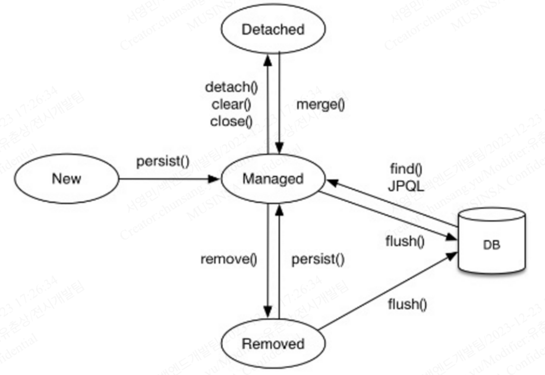
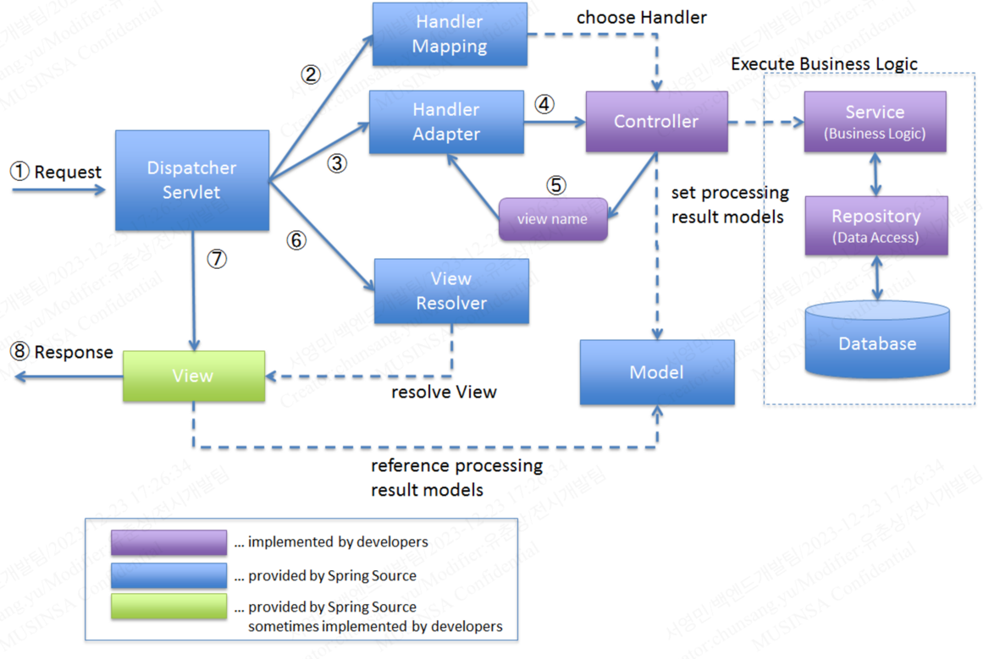
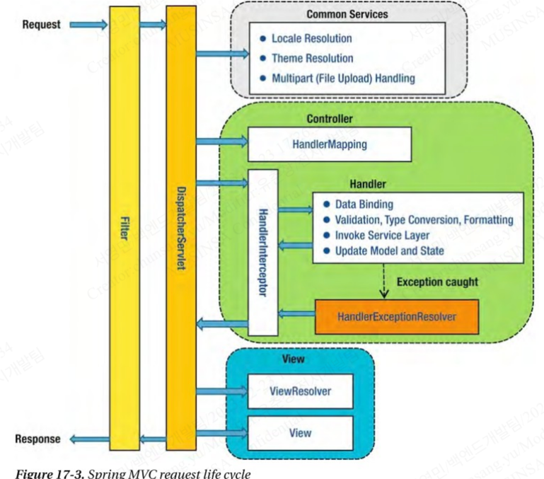
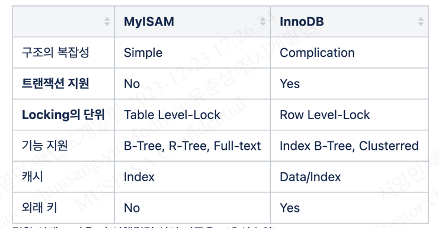

# 링크

- 전시팀
  - https://wiki.musinsa.com/pages/viewpage.action?pageId=43164827
  - https://wiki.musinsa.com/pages/viewpage.action?pageId=76606970
- 회원팀
  - https://wiki.musinsa.com/pages/viewpage.action?pageId=5346737
  - 장애대처
    - https://wiki.musinsa.com/pages/viewpage.action?pageId=62839223
- 기술인터뷰 모음
  - https://gyoogle.dev/blog/ 
  - https://velog.io/@wsh096/%EB%B6%81%EC%8A%A4%ED%84%B0%EB%94%94-%EC%9E%90%EB%B0%94-%EC%BD%94%EB%94%A9-%EC%9D%B8%ED%84%B0%EB%B7%B0-%EC%99%84%EB%B2%BD-%EA%B0%80%EC%9D%B4%EB%93%9C
  - https://dibrary.tistory.com/57
  - https://product.kyobobook.co.kr/detail/S000001834833?utm_source=google&utm_medium=cpc&utm_campaign=googleSearch&gad_source=1&gclid=Cj0KCQiA4Y-sBhC6ARIsAGXF1g5sqb8ct-aBmnQtjG7TGf7jRH4lYTovpE5I18LKJ3bPjerb66yEgoYaAoUrEALw_wcB
  - https://www.aladin.co.kr/shop/wproduct.aspx?ItemId=322636652&start=pgooglemc

---

## 전시팀 1

---

### 필수 질문

이직 사유
무신사 지원 사유 

---

### Java

#### Java core

> JVM의 메모리 구조에 대하여 간략히 설명하시오.

- Method Area, Heap Area, Stack Area (+ Native Method Stack)
  - Method Area(Static Area) : 클래스에 대한 정보를 저장하는 공간
  - Heap Area : 인스턴스가 생성되는 공간
  - Stack Area : 메서드 작업에 필요한 메모리 공간으로 지역변수들과 연산의 중간결과 등이 저장
  - Native Method Stack : 자바 이외의 언어로 된 코드를 위한 스택 (JNI, Java Native Interface 를 통한 호출)
  
> Garbage collection (GC)에 대하여 간략히 설명하시오.

- Java 8 로 넘어가면서 생긴 차이점 (Permanent Area → Metaspace)
- GC 의 종류를 아는데로 말하시오.
  - Serial GC, Parallel GC, Parallel Old GC, CMS(Concurrent Mark & Sweep) GC, G1 GC
  - G1 GC 에 대하여 설명하시오 (다른 GC들과의 큰 차이점)
  
> Collection Interface 핵심 구현체에 대하여 아는데로 설명하시오.

> Thread Safe 한 리스트 생성 방법은?

- Collections.synchronizedList
- https://docs.oracle.com/javase/6/docs/api/java/util/Collections.html#synchronizedList(java.util.List)

> Java Reflection 에 대하여 아시나요?

- 구체적인 클래스 타입을 알지 못해도, 그 클레스의 메소드, 타입, 변수들을 접근할 수 있도록 해주는 자바 API  
- 동적으로 클래스를 사용해야할 때  필요 (코드 작성 시점에 어떤 클래스를 사용해야할 지 모르는 경우, 런타임 시점에 클래스를 가져와서 실행해야 하는 경우 사용

> ThreadLocal 에 대하여 아시나요?

- ThreadLocal 변수를 선언하면 멀티 스레드 환경에서 각 스레드마다 독립적인 변수를 가지고, get(), set() 메소드를 통해 값에 대해 접근 가능하다

> Primitive Type 과 Wrapper Class 의 사용 기준이 있나?

- Java 데이터 타입의 종류로 크게 Primitive Type (기본형, byte/int/long/double 등 ) 과 Reference Type (참조형) 이 있음
- Reference Type 에는 Primitive Type 에 대한 Wrapper Class (Byte/Integer/Long/Double 등) 도 포함됨.
- Wrapper Class 의 특징
  - 산술 연산 불가
  - null 로 초기화 불가
- Wrapper Class 를 써야 하는 경우
  - DB 연동 시 null 이 필요한 경우
  - 매개변수로 객체형이 요구될 때
  - 기타 등등

#### Java 8

> Java 8 의 특징에 대하여 설명하시오

- Lambda expressions, Method reference, Functional interface, Stream, Parallel stream, Default method, Optional, CompletableFuture, New date/time APIs

> Stream 중간 연산자 / 최종 연산자

- 중간 연산자에 대하여 아는 데로 말하시오
  - 자르기(skip, limit), 필터(filter, distinct), 정렬(sorted), 매핑(map, flatMap), 기타(peek)
- 최종 연산자
  - 반복(forEach, forEachOrdered), 배열로 변환(toArray), 조건 검사(allMatch, anyMatch, noneMatch), 조건 일치요소 찾기(findFirst, findAny), 통계(count, sum, average, max, min), 리듀스(reduce)
  
> Java 8 Map 과 Flatmap 의 차이를 설명하시오

- Function<? super T, ? extends R>
- Function<? super T, ? extends Stream<? extends R>>
  - 중첩구조를 한 단계 제거하고 단일 컬렉션으로 만들어 주는 역할을 하며, 이러한 작업을 Flattening 이라고 함

> Functional Interface (아래 중 택 1) 에 대하여 설명하시오 (인자, 리턴 값, 실행메소드 이름)

- Runnable

```java
public interface Runnable {
public abstract void run();
}
```

- Supplier<T>

```java
public interface Supplier<T> {
    T get();
}
```

- Consumer<T>

```java
public interface Consumer<T> {
    void accept(T t);
 
    default Consumer<T> andThen(Consumer<? super T> after) {
        Objects.requireNonNull(after);
        return (T t) -> { accept(t); after.accept(t); };
    }
}
```

- Function<T, R>

```java
public interface Function<T, R> {
    R apply(T t);
 
    default <V> Function<V, R> compose(Function<? super V, ? extends T> before) {
        Objects.requireNonNull(before);
        return (V v) -> apply(before.apply(v));
    }
 
    default <V> Function<T, V> andThen(Function<? super R, ? extends V> after) {
        Objects.requireNonNull(after);
        return (T t) -> after.apply(apply(t));
    }
 
    static <T> Function<T, T> identity() {
        return t -> t;
    }
}
```

- Predicate<T>

```java
public interface Predicate<T> {
    boolean test(T t);
 
    default Predicate<T> and(Predicate<? super T> other) {
        Objects.requireNonNull(other);
        return (t) -> test(t) && other.test(t);
    }
 
    default Predicate<T> negate() {
        return (t) -> !test(t);
    }
 
    default Predicate<T> or(Predicate<? super T> other) {
        Objects.requireNonNull(other);
        return (t) -> test(t) || other.test(t);
    }
 
    static <T> Predicate<T> isEqual(Object targetRef) {
        return (null == targetRef)
                ? Objects::isNull
                : object -> targetRef.equals(object);
    }
}
```
  
> JPA

> JPA 엔티티 생명주기 4가지에 대하여 설명하시오
  
- 비영속, 영속, 준영속, 삭제
  - 비영속(new/transient) : 영속성 컨텍스트와 관계가 없는 상태
  - 영속(managed) : 영속성 컨텍스트에 저장된 상태
  - 준영속(detached) : 영속성 컨텍스트에 저장되었다가 분리된 상태
  - 삭제(removed) : 삭제된 상태
  


> JPA 1차 캐시와 2차 캐시의 차이점
  
- 1차 캐시는 영속성 컨텍스트
- 2차 캐시는 애플리케이션 범위의 캐시 지원

> JPA N+1 문제 및 해결방안
  
- JPQL 패치 조인 사용(Join Fetch), @EntityGraph, @BatchSize + FetchType.EAGER

> Gradle

- dependencty 항목에서 implemetation vs compile(or api)
  - https://hack-jam.tistory.com/13 

---

## Spring framework

> 스프링 프레임워크의 주요 특징에 대하여 간락히 설명하시오

- POJO (Plain Old Java Object)
- 제어 역전 (IoC, Inversion Of Control)
- 의존성 주입 (DI, Dependency Injection)
- 관점지향 프로그래밍 (AOP, Aspect Oriented Programming)
  
> Spring MVC 요청 라이프사이클에 대하여 설명해주세요. (Spring MVC 작동 원리)

1. 클라이언트는 URL을 통해 요청을 전송한다.
2. 디스패처 서블릿은 핸들러 매핑을 통해 해당 요청이 어느 컨트롤러에게 온 요청인지 찾는다.
3. 디스패처 서블릿은 핸들러 어댑터에게 요청의 전달을 맡긴다.
4. 핸들러 어댑터는 해당 컨트롤러에 요청을 전달한다.
5. 컨트롤러는 비지니스 로직을 처리한 후에 반환할 뷰의 이름을 반환한다.
6. 디스패처 서블릿은 뷰 리졸버를 통해 반환할 뷰를 찾는다.
7. 디스패처 서블릿은 컨트롤러에서 뷰에 전달할 데이터를 추가한다.
8. 데이터가 추가된 뷰를 반환한다.    



> DI (Dependency Injection) 의존 관계 주입 방법 종류 및 선호하는 방법 과 그 이유

- Field injection (@Autowired), Setter based injection, Constructor based injection
  - Constructor based injection (생성자 주입) 방식을을 권장하는 이유는? 
    - 순환 참조 방지(컴파일 단계 오류 발생), 테스트 용이성, 불변성(필드를 `final` 로 선언 가능)

> Bean scope 종류에 대하여 말하시오

- Singleton (Default), Prototype, Request, Session, Global Session 
  - Singleton : 스프링 컨테이너에 의해 한 번 생성 
  - Prototype : 의존성 관계의 빈이 주입될 때마다 새로운 객체 생성

> AOP (Aspect Oriented Programming, 관점 지향 프로그래밍) 구성요소

- Target, JoinPoint, PointCut, Advice, Aspect, Weaving
- Advice 에 대한 답변이 나온다면, Advice 의 종류에 대하여 말하시오 
  - Before(이전), After(이후), AfterReturning(정상적 반환 이후), AfterThrowing (예외 발생 이후), Around(메소드 실행 전후)

> 필터(Filter)와 인터셉터(Interceptor)의 차이에 대하여 말하시오.

- 필터(Filter)는 DispatcherServlet 앞단에서 정보 처리
- 인터셉터(Interceptor)는 DispatcherServlet 에서 Handler(Controller)로 요청이 가기 전에 실행



---

## Database

> 트랜잭션 격리수준(Transaction Isolation level) 에 대하여 설명하시오

- READ UNCOMMITED(dirty read)
- READ COMMITTED(un-repeatable read)
- REPETABLE READ(phantom read)
- SERIALIZABLE

> MySQL Storage Engine (MyISAM vs InnoDB) 의 차이점에 대하여 간략히 설명하시오



> 결합 인덱스 사용 시 선행컬럼 선정 기준은? (우선순위)

- 1단계: 항상 사용하는가? (빈번히 사용되는가?)
- 2단계: 항상 '='로 사용하는가?
- 3단계: 어느 것이 더 좋은 분포도를 가지는가? 
  - 분포도의 값이 낮으면서(같은 값이 적으면서) 데이터가 일정하게 분포되어 있는지
- 4단계: 자주 정렬되는 순서는 무엇인가?
- 5단계: 부가적으로 추가시킬 컬럼은 어떤 것으로 할 것인가?

> 쿼리 실행 순서

- **FROM** → ON → JOIN → **WHERE** → **GROUP BY** → **HAVING** → **SELECT** → DISTINCT → **ORDER BY**

> char vs varchar

- https://goodgid.github.io/JS-char-vs-varchar/
- char(10) 으로 설정 후 4글자 문자를 입력하면 남는 공간은 어떻게 처리되나? 

> partitioning 과 sharding 은 다른건가요? 

- 다르다면 어떻게 다른건가요?
  - https://www.google.com/search?q=partitioning+sharding 

> 리플리케이션(Replication) vs 클러스터링(Clustering)

- https://www.google.com/search?q=replication+vs+clustering

> primary key 와 unique key 를 어떻게 구분해 사용하나요?

- https://www.google.com/search?q=primary+key+unique+key

---

## Network

> HTTP Status Codes

- https://developer.mozilla.org/ko/docs/Web/HTTP/Status

> HTTP Methods

- https://developer.mozilla.org/ko/docs/Web/HTTP/Methods
- PUT Method vs PATCH Method 의 차이점을 설명하시오
  - 리소스 전체 vs 리소스 일부

> REST API 에 대하여 설명하시오.

- HTTP URI(Uniform Resource Identifier)를 통해 자원(Resource)을 명시하고, HTTP Method(POST, GET, PUT, DELETE)를 통해 해당 자원에 대한 CRUD Operation을 적용하는 것을 의미
- RESTful 이란?

> HTTP2.0 에 대하여 아시나요? 아신다면 주요 특징과 HTTP/1.1 과의 차이는?

> 로드 밸런싱(Load Balancing) 이 왜 필요한지에 대하여 간략히 설명하시오

- 로드밸런싱은 여러 대의 서버를 두고 서비스를 제공하는 분산 처리 시스템에서 필요한 기술
- Scale-out의 방식으로 서버를 증설 시 여러 대의 서버로 트래픽을 균등하게 분산해주는 로드밸런싱이 반드시 필요

> 무신사 스토어 사이트 URL 값을 브라우저에 입력하였을 때 어떤 일들이 일어나는지 설명하시오

- 브라우저 → 프로토콜 스택, LAN 어댑터 → 허브, 스위치, 라우터 → 액세스 회선, 프로바이더 → 방화벽, 게이트웨이, 캐시서버 → 웹 서버 → WAS

> 서버 사이드 랜더링(SSR) 와 클라이언트 사이드 랜더링(CSR) 에 대하여 설명하시오

> CDN 이란 무엇이고, 어떤 경우에 사용합니까?

- Content Delivery Network

> SOP(Same-Origin Policy) 와 CORS (Cross-Origin Resource Sharing) 에 대해 아는대로 설명해 주세요.

- https://www.google.com/search?q=sop+cors

---

## Architecture

> MSA 적용 시 분리된 두 개의 데이터 저장소에서 Transaction 을 처리하는 방법은?

- https://www.google.com/search?q=msa+transaction 

> Async 와 Non-Blocking 에 대해 설명해 주세요

- https://www.google.com/search?q=async+non+blocking 

> Redis 사용 시 주의할 점

- Redis 는 In memory data store
  - 당연히 메모리 관리 잘해줘야 함
    - physical memory 이상 사용하면 swap 메모리 사용 → 느려짐
- Redis 는 Single thread
  - 동시에 여러개의 일은 처리 못함 → 그래서 오래 걸리는 일 시키면 안됨
    - 오래 걸리는 대표적 명령어
      - keys , flushall, flushdb, delete collections, get all collections

---

## Javascript

> 호이스팅(hoisting)이란?

- https://www.google.com/search?q=hoisting

> 클로저(closure)란?

- https://www.google.com/search?q=javascript+closure

> 자바스크립트에서 이벤트 전파를 중단하는 방법을 아시는대로 설명 해 주세요

- https://www.google.com/search?q=javascript+%EC%9D%B4%EB%B2%A4%ED%8A%B8+%EC%A0%84%ED%8C%8C+%EC%A4%91%EB%8B%A8

> 자바스크립트 이벤트(Event)의 버블링(Bubbling) 과 캡처링(Capturing) 에 대해 설명해 주세요

- https://www.google.com/search?q=javascript+event+bubbling
- 둘 중 DOM 의 기본동작은 무엇인가요? 

---

## Secure

> XSS (Cross Site Script) 공격이란 무엇이고, 어떻게 방어하나?

- https://www.google.com/search?q=xss

> SQL Injection 이란 무엇이고, 어떻게 방어하나?

- https://www.google.com/search?q=sql+injection

---

## ETC

> 최근 관심있는 토픽이나 공부하고 있는게 있다면?

> 최근 경험한 장애

- 현상, 원인, 해결, 재발방지 등 4가지 포인트 체크. 빠진게 있다면 질문.

> 무신사에 입사해서 개선하거나 바꾸고 싶은 부분이 있다면? 혹은 이런 기능이 있으면 좋겠다?

- (후속질문) 그걸 어떤 방식으로 할건지

> 일 잘하는 사람은 어떤 사람이라고 생각하나?


---

## More

- https://programmers.co.kr/posts/tag/%EA%B8%B0%EC%88%A0%EB%A9%B4%EC%A0%91%EB%8C%80%EB%B9%84
- 설로인이란 업체에서 공개한 인터뷰 내용 : https://github.com/sirloin-dev/meatplatform/blob/master/job-description/interview-questions.adoc?fbclid=IwAR1J_yQMkRFFpCxnnQvj63tnAe4AFtT3lcqE60xOZEWydufbYR1_Wunx6yE#interview-questions-java-jvm
